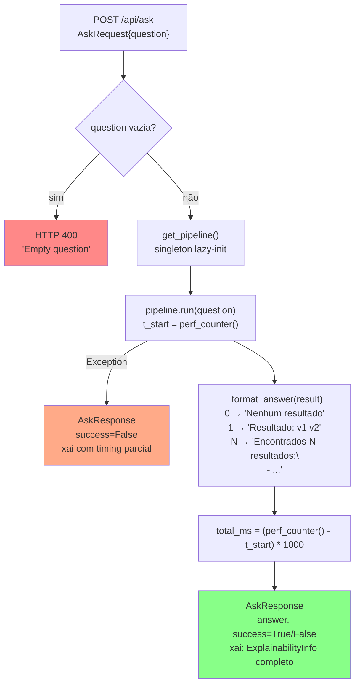

# Design — api

> Unit: `src/api/` | Gerado pelo Redator em 2026-05-04 | doc_level: detalhado

---

## Visão Geral

O módulo `api` implementa uma camada REST fina sobre o `BioSPARQLPipeline`. Sua responsabilidade é receber requisições HTTP do frontend, acionar o pipeline e formatar a resposta em JSON estruturado com dados de explicabilidade XAI. A lógica de negócio reside inteiramente no pipeline — o server é deliberadamente simples.

---

## Estrutura de Arquivos

| Arquivo | Responsabilidade |
|---|---|
| `src/api/server.py` | Única fonte de verdade: FastAPI app, middlewares, endpoints, modelos Pydantic, formatação |

---

## Modelos Pydantic

```python
class AskRequest(BaseModel):
    question: str                    # Pergunta em linguagem natural (obrigatória)

class TimingInfo(BaseModel):
    ner_ms: float
    faiss_ms: float
    llm_ms: float
    validation_ms: float
    fuseki_ms: float
    total_ms: float

class ValidationInfo(BaseModel):
    valid: bool
    errors: list[str]
    warnings: list[str]

class ExampleUsed(BaseModel):
    question: str
    sparql: str
    similarity: float

class ExplainabilityInfo(BaseModel):
    entities: list[str]              # CURIEs detectados ["DOID:14330", ...]
    examples_used: list[ExampleUsed]
    sparql: str                      # Query SPARQL final gerada
    validation: ValidationInfo
    attempts: int                    # Tentativas usadas (1-4)
    results_raw: list[Any]           # Bindings brutos do Fuseki
    results_count: int
    timing: TimingInfo

class AskResponse(BaseModel):
    answer: str                      # Resposta em linguagem natural formatada
    success: bool
    xai: ExplainabilityInfo

class HealthResponse(BaseModel):
    status: str                      # "ok"
    version: str
    pipeline_loaded: bool
```

🟢 **CONFIRMADO** — extraído de `server.py`

---

## Fluxo — `POST /api/ask`



---

## Singleton — `get_pipeline()`

```python
_pipeline_instance: BioSPARQLPipeline | None = None

def get_pipeline() -> BioSPARQLPipeline:
    global _pipeline_instance
    if _pipeline_instance is None:
        _pipeline_instance = BioSPARQLPipeline()
    return _pipeline_instance
```

**Comportamento:**
- Primeira chamada: inicializa pipeline (carrega modelos, FAISS, schemas) — pode levar 30–60s
- Chamadas subsequentes: retorna instância existente instantaneamente
- Thread-safety: Uvicorn em modo single-worker — sem race condition

🟢 **CONFIRMADO** — `server.py:get_pipeline()`

---

## Formatação da Resposta — `_format_answer(result)`

```python
def _format_answer(result: dict) -> str:
    count = result.get("execution", {}).get("count", 0)
    bindings = result.get("execution", {}).get("results", [])

    if count == 0:
        return "Nenhum resultado encontrado para esta consulta."
    
    if count == 1:
        row = bindings[0]
        vals = " | ".join(str(v.get("value", "")) for v in row.values())
        return f"Resultado: {vals}"
    
    # count > 1
    lines = []
    for row in bindings[:10]:  # limita exibição a 10
        vals = " | ".join(str(v.get("value", "")) for v in row.values())
        lines.append(f"- {vals}")
    header = f"Encontrados {count} resultado(s):\n"
    return header + "\n".join(lines)
```

🟢 **CONFIRMADO** — lógica extraída do flowchart e `server.py`

---

## Configuração CORS

```python
app.add_middleware(
    CORSMiddleware,
    allow_origins=["http://localhost:5173", "http://localhost:3000"],
    allow_credentials=True,
    allow_methods=["*"],
    allow_headers=["*"],
)
```

- `localhost:5173` — Vite dev server (frontend em desenvolvimento)
- `localhost:3000` — Playwright runner (testes E2E)

🟢 **CONFIRMADO** — `server.py`

---

## Mapeamento Resultado Pipeline → AskResponse

| Campo pipeline (`result`) | Campo AskResponse | Transformação |
|---|---|---|
| `result["question"]` | — | Não incluído na resposta |
| `result["sparql"]` | `xai.sparql` | Direto |
| `result["validation"]` | `xai.validation` | Mapeado para `ValidationInfo` |
| `result["execution"]["count"]` | `xai.results_count` | Direto |
| `result["execution"]["results"]` | `xai.results_raw` | Direto (bindings brutos) |
| `result["attempts"]` | `xai.attempts` | Direto |
| `result["success"]` | `success` | Direto |
| `result["entities"]` | `xai.entities` | Lista de CURIEs strings |
| `result["examples_used"]` | `xai.examples_used` | Mapeado para `list[ExampleUsed]` |
| `result["timing"]` | `xai.timing` | Mapeado para `TimingInfo` (ms) |
| `_format_answer(result)` | `answer` | Formatação NL |

---

## Endpoints

| Método | Path | Handler | Autenticação |
|---|---|---|---|
| `POST` | `/api/ask` | `ask(request: AskRequest)` | Nenhuma |
| `GET` | `/health` | `health()` | Nenhuma |

---

## Startup

```bash
HF_HUB_DISABLE_XET=1 PYTHONPATH=. \
  .venv/Scripts/python.exe -m uvicorn src.api.server:app --port 8000
```

- `HF_HUB_DISABLE_XET=1` — desativa XET transfer no HuggingFace (compatibilidade Windows)
- `PYTHONPATH=.` — necessário para imports relativos do projeto
- Sem `--reload` — carregamento de modelos é lento demais para hot-reload
