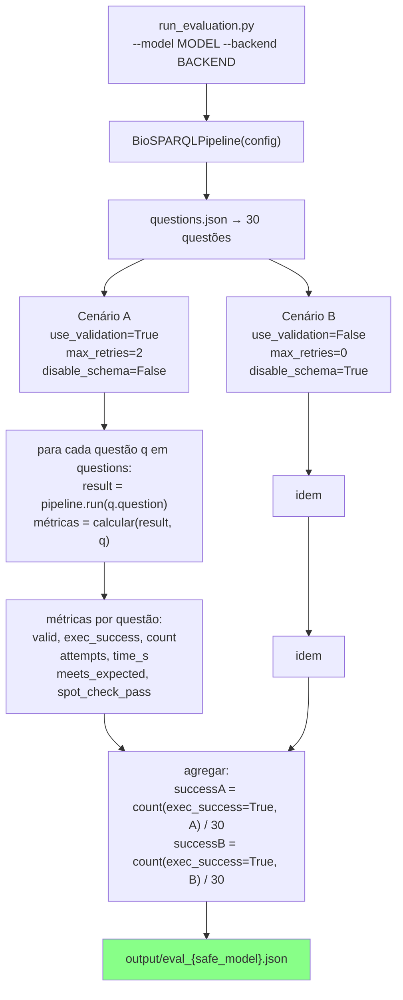
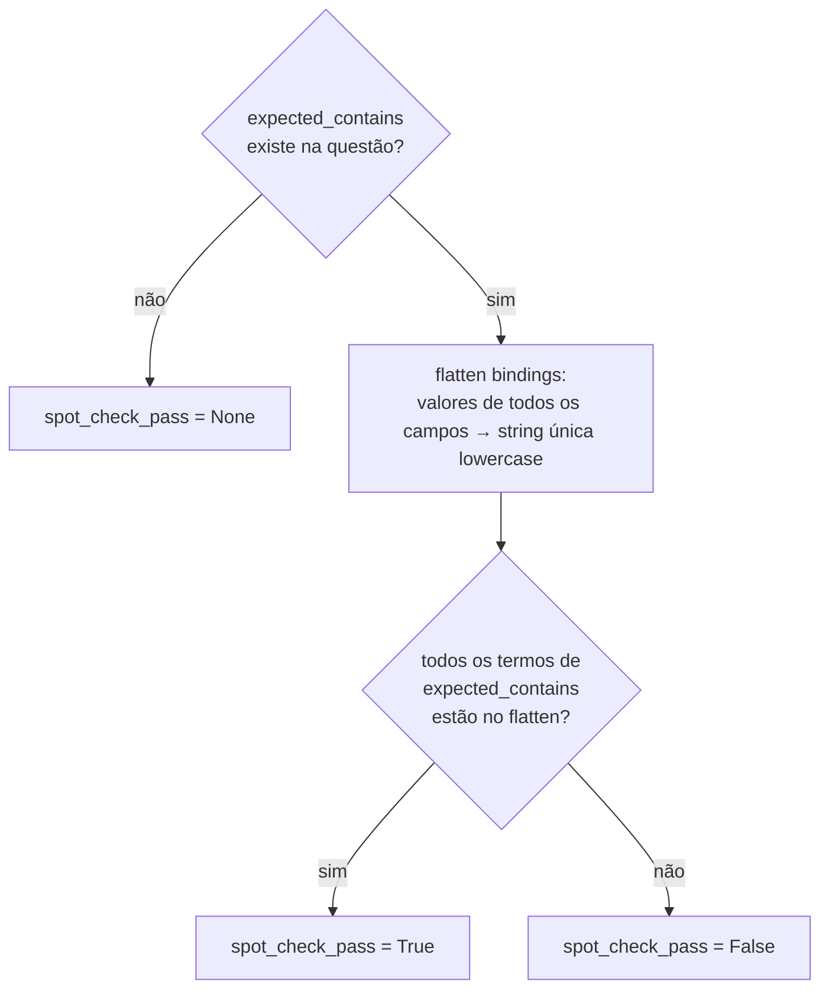
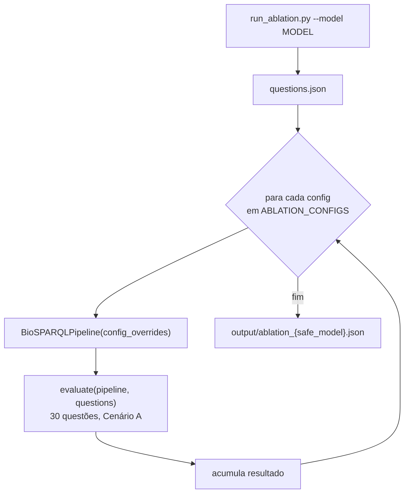

# Design — avaliacao

> Unit: `src/evaluation/` | Gerado pelo Redator em 2026-05-04 | doc_level: detalhado

---

## Visão Geral

O módulo `avaliacao` é um framework CLI de avaliação científica reprodutível. Não expõe API nem interface gráfica — é acionado por linha de comando e produz arquivos JSON e `.tex`. O design segue um pipeline linear: instanciar modelo → avaliar 30 questões × N cenários → salvar JSON → consolidar → gerar LaTeX.

---

## Estrutura de Arquivos

| Arquivo | Responsabilidade |
|---|---|
| `src/evaluation/run_evaluation.py` | Avaliação single-model: 2 cenários, 30 questões, spot-check |
| `src/evaluation/run_all_models.py` | Orquestrador multi-modelo: itera modelos e chama run_evaluation |
| `src/evaluation/ablation_configs.py` | Define as 6 configurações de ablação como dicts |
| `src/evaluation/run_ablation.py` | Executa ablação: 6 configs × 30 questões |
| `src/evaluation/consolidate.py` | Agrega `eval_*.json` em `evaluation_multi_model.json` |
| `src/evaluation/latex_tables.py` | Gera fragmentos `.tex` a partir dos JSONs consolidados |
| `src/evaluation/inter_annotator.py` | Cálculo de concordância entre anotadores (kappa) |
| `src/evaluation/bench_ner.py` | Benchmark de backends NER (P/R/F1) |

---

## Fluxo Principal — Avaliação Single-Model



---

## Estrutura do Arquivo de Saída — `eval_{safe_model}.json`

```json
{
  "model": "nvidia/nemotron-3-nano-4b",
  "backend": "lmstudio",
  "evaluated_at": "2026-05-04T12:00:00Z",
  "scenarios": {
    "A": {
      "config": {"max_retries": 2, "disable_schema": false, "disable_ner": false},
      "results": [
        {
          "id": "Q01",
          "question": "Quais fenótipos estão associados ao Parkinson?",
          "difficulty": "easy",
          "sparql_generated": "SELECT ...",
          "valid": true,
          "exec_success": true,
          "results_count": 8,
          "attempts": 1,
          "time_seconds": 12.4,
          "meets_expected": true,
          "spot_check_pass": true,
          "error": null
        }
      ],
      "summary": {
        "total": 30,
        "exec_success": 24,
        "success_rate": 0.80,
        "avg_attempts": 1.6,
        "avg_time_s": 14.2
      }
    },
    "B": { "...": "..." }
  }
}
```

🟢 **CONFIRMADO** — estrutura inferida de `run_evaluation.py` e resultados em `output/`

---

## Spot-Check Semântico



**Exemplo:**
```python
expected_contains = ["parkinson", "tremor"]
bindings_flat = "parkinson disease | hp:0001337 | tremor"
# "parkinson" in flat → True
# "tremor" in flat → True
# spot_check_pass = True
```

🟢 **CONFIRMADO** — lógica em `run_evaluation.py`

---

## Configurações de Ablação — `ablation_configs.py`

```python
ABLATION_CONFIGS = [
    {
        "name": "full",
        "disable_ner": False,
        "disable_fewshot": False,
        "disable_schema": False,
        "disable_validation": False,
        "max_retries": 2,
    },
    {
        "name": "no_ner",
        "disable_ner": True,
        "disable_fewshot": False,
        "disable_schema": False,
        "disable_validation": False,
        "max_retries": 2,
    },
    {
        "name": "no_fewshot",
        "disable_ner": False,
        "disable_fewshot": True,   # top_k_examples=0
        "disable_schema": False,
        "disable_validation": False,
        "max_retries": 2,
    },
    {
        "name": "no_schema",
        "disable_ner": False,
        "disable_fewshot": False,
        "disable_schema": True,
        "disable_validation": False,
        "max_retries": 2,
    },
    {
        "name": "no_validation",
        "disable_ner": False,
        "disable_fewshot": False,
        "disable_schema": False,
        "disable_validation": True,
        "max_retries": 0,
    },
    {
        "name": "zero_shot",
        "disable_ner": True,
        "disable_fewshot": True,
        "disable_schema": True,
        "disable_validation": True,
        "max_retries": 0,
    },
]
```

🟢 **CONFIRMADO** — `ablation_configs.py`

---

## Fluxo de Ablação — `run_ablation.py`



---

## Consolidação — `consolidate.py`

Lê todos os `output/eval_*.json` e agrega em `evaluation_multi_model.json`:

```python
{
  "models": ["google/gemma-3-4b", "nvidia/nemotron-3-nano-4b", "qwen/qwen3.5-9b"],
  "scenarios": {
    "A": {
      "google/gemma-3-4b":        {"success_rate": 0.467, "avg_attempts": 2.1},
      "nvidia/nemotron-3-nano-4b": {"success_rate": 0.800, "avg_attempts": 1.6},
      "qwen/qwen3.5-9b":          {"success_rate": 0.500, "avg_attempts": 1.9}
    },
    "B": { "...": "..." }
  }
}
```

---

## Geração LaTeX — `latex_tables.py`

Produz fragmentos `.tex` em `output/tables/`:

| Arquivo | Conteúdo |
|---|---|
| `table_main_results.tex` | Tabela principal: Modelo × Cenário A/B × Success Rate |
| `table_ablation.tex` | Tabela ablação: Config × Success Rate por modelo |
| `table_per_difficulty.tex` | Taxa de sucesso por dificuldade (easy/medium/hard) |

Formato padrão: `tabular` com `\hline`, compatível com template SBC (10 páginas máx).

---

## Convenção de Nomes de Arquivo

```python
safe_name = model.replace("/", "_")
# "nvidia/nemotron-3-nano-4b" → "nvidia_nemotron-3-nano-4b"
output_path = f"output/eval_{safe_name}.json"
ablation_path = f"output/ablation_{safe_name}.json"
```

🟢 **CONFIRMADO** — documentado em `CLAUDE.md`

---

## Resultado Chave da Avaliação (referência)

| Modelo | Params | Cenário A | Cenário B |
|---|---|---|---|
| `nvidia/nemotron-3-nano-4b` | 4B | **80.0%** | ~60% |
| `qwen/qwen3.5-9b` | 9B | 50.0% | ~40% |
| `google/gemma-3-4b` | 4B | 46.7% | ~35% |

🟢 **CONFIRMADO** — `output/eval_*.json` e `CLAUDE.md`

**Insight:** Nemotron 4B supera Qwen 9B — arquitetura (raciocínio com `reasoning_content`) importa mais que tamanho de parâmetros.
