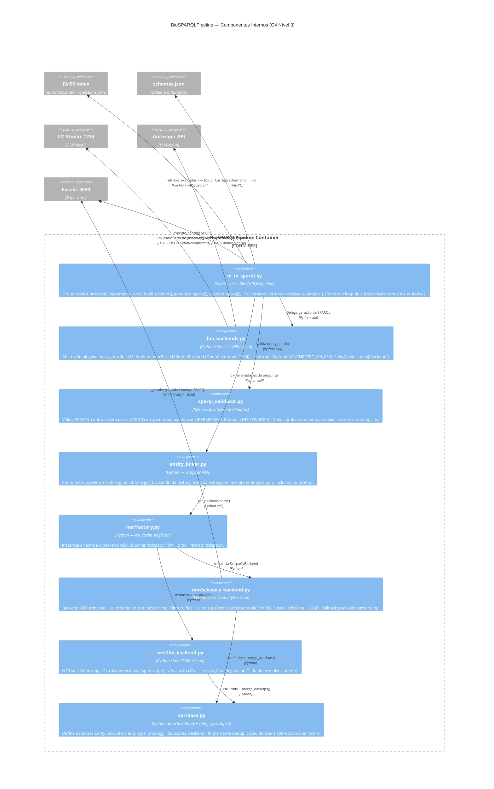
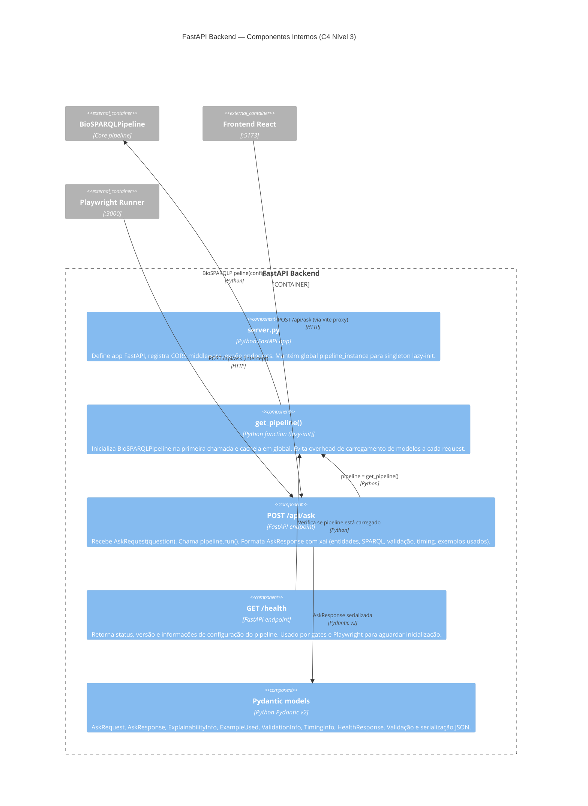
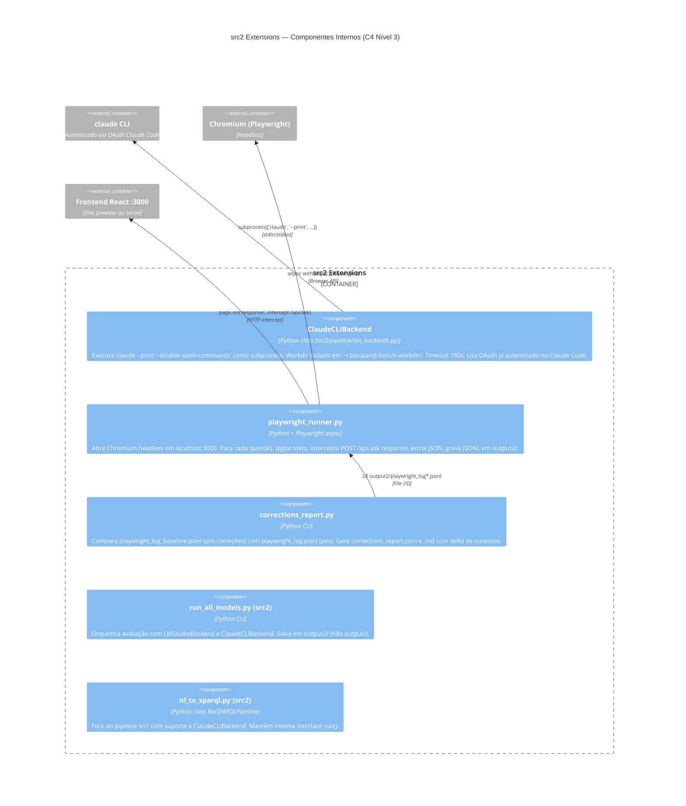

# C4 — Nível 3: Componentes

> Gerado pelo Arquiteto em 2026-05-04 | doc_level: detalhado

---

## Container: BioSPARQLPipeline (src/pipeline)

O container mais complexo do sistema. Decomposto abaixo em seus componentes internos.



---

## Container: FastAPI Backend (src/api)



---

## Container: NER Engine — Backends Disponíveis

| Backend | Classe | Extração | Grounding | Uso Típico |
|---|---|---|---|---|
| `scispacy` | `ScispaCyBackend` | spaCy NER model `en_ner_bc5cdr_md` | SPARQL Fuseki (rdfs:label) + Gilda fallback | Padrão — melhor F1 |
| `llm` | `LLMBackend` | LLM prompt extrai spans | Gilda (score ≥ 0.5) | Alternativo sem spaCy |
| `gilda` | Integrado no ScispaCy | — | `gilda.ground()` whitelist namespaces | Só resolução |

### Seleção de Backend
```
BIOSPARQL_NER_BACKEND=scispacy  # env var (padrão se ausente)
→ factory.get_backend("scispacy") → lru_cache singleton → ScispaCyBackend
```

---

## Container: src2 Extensions — Componentes


