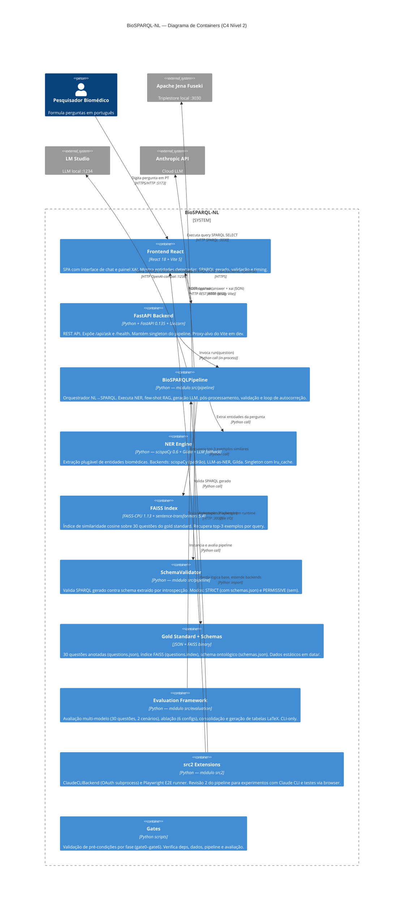

# C4 — Nível 2: Containers

> Gerado pelo Arquiteto em 2026-05-04 | doc_level: detalhado

---

## Diagrama

---

## Descrição dos Containers

### Frontend React
- **Tech:** React 18.3.1 + Vite 5.4.0 + axios
- **Porta:** 5173 (dev), 3000 (Playwright)
- **Responsabilidade:** Interface de chat single-page com painel XAI colapsável. Exibe entidades detectadas (highlights), query SPARQL gerada, status de validação, número de tentativas e breakdown de timing.
- **Comunicação:** Proxy Vite em `/api/*` → `localhost:8000`.

### FastAPI Backend
- **Tech:** FastAPI 0.135.3 + Uvicorn 0.44.0 + Pydantic 2.12.5
- **Porta:** 8000
- **Endpoints:** `GET /health`, `POST /api/ask`
- **Responsabilidade:** Interface REST, gerenciamento de singleton do pipeline (lazy-init no primeiro request).
- **CORS:** `localhost:5173` e `localhost:3000` apenas.

### BioSPARQLPipeline
- **Tech:** Python puro + integrações com NER, FAISS, LLM backends
- **Responsabilidade:** Orquestração completa do fluxo NL→SPARQL. Inclui construção de prompt, pós-processamento (8 regex), loop de autocorreção com até 4 tentativas e semantic retry.

### NER Engine
- **Tech:** scispaCy 0.6.2 + spaCy 3.7.5 + Gilda + OpenAI SDK
- **Padrão:** `scispacy` (com fallback para zero-shot se falhar)
- **Responsabilidade:** Extração de spans biomédicos e resolução para CURIEs ontológicos (DOID/HP).

### FAISS Index
- **Tech:** FAISS-CPU 1.13.2 + sentence-transformers 5.4.0 (all-MiniLM-L6-v2, 384d)
- **Responsabilidade:** Recuperação por similaridade cosine das 30 questões do gold standard para few-shot prompting.

### SchemaValidator
- **Tech:** Python + rdflib/SPARQLWrapper (para extração) + regex (para validação)
- **Responsabilidade:** Valida grafos, prefixos, classes e predicados de queries SPARQL geradas. Bloqueia operações de escrita (DELETE/INSERT).

### Evaluation Framework
- **Tech:** Python CLI scripts
- **Responsabilidade:** Avaliação reprodutível de múltiplos modelos. Gera `output/eval_*.json`, tabelas comparativas e fragmentos LaTeX para o paper.

### src2 Extensions
- **Tech:** Python + Playwright (via playwright CLI)
- **Responsabilidade:** Revisão 2 do pipeline que adiciona `ClaudeCLIBackend` (autenticação OAuth via `claude` CLI subprocess) e `PlaywrightRunner` para testes E2E sobre o frontend real.

### Gates
- **Tech:** Python scripts CLI
- **Responsabilidade:** Validação sequencial de pré-condições antes de avançar de fase. `gate0` (deps), `gate1` (dados), `gate2` (pipeline), `gate3` (avaliação), `gate6` (final).
