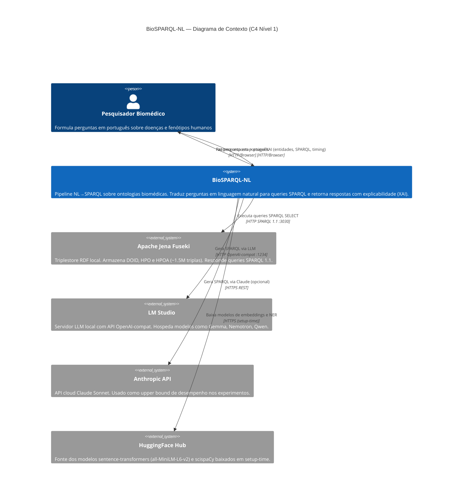

# C4 — Nível 1: Contexto do Sistema

> Gerado pelo Arquiteto em 2026-05-04 | doc_level: detalhado

---

## Diagrama

---

## Personas

### Pesquisador Biomédico
- **Perfil:** Pesquisador, estudante ou clínico que precisa consultar bases de conhecimento biomédico (DOID, HPO) sem conhecer SPARQL.
- **Necessidade:** Formular perguntas em linguagem natural e obter respostas estruturadas com rastreabilidade das fontes.
- **Interação:** Via interface web (browser), porta 5173.

---

## Sistemas Externos

| Sistema | Tipo | Localização | Protocolo | Confiança |
|---|---|---|---|---|
| Apache Jena Fuseki 6.0.0 | Triplestore RDF (TDB2) | localhost:3030 | SPARQL 1.1 over HTTP | 🟢 CONFIRMADO |
| LM Studio | LLM local server | localhost:1234 | OpenAI-compat REST | 🟢 CONFIRMADO |
| Anthropic API | LLM cloud | api.anthropic.com | HTTPS REST | 🟢 CONFIRMADO |
| HuggingFace Hub | Repositório de modelos | huggingface.co | HTTPS (setup-time apenas) | 🟢 CONFIRMADO |

---

## Fronteiras do Sistema

**Dentro do sistema BioSPARQL-NL:**
- Frontend React (SPA + painel XAI)
- FastAPI Backend
- Pipeline NL→SPARQL (NER, FAISS, geração, validação, correção)
- Dados estáticos: gold standard, schemas.json, FAISS index

**Fora do sistema (externos):**
- Triplestore Fuseki (dado como infra pré-existente)
- Modelos LLM (servidos externamente via LM Studio ou cloud)
- Ontologias brutas (doid.owl, hp.owl, phenotype.hpoa) — dados de entrada pré-carregados
