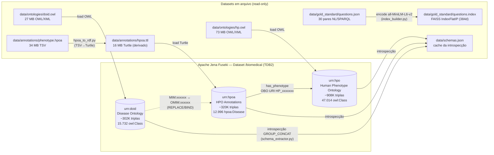
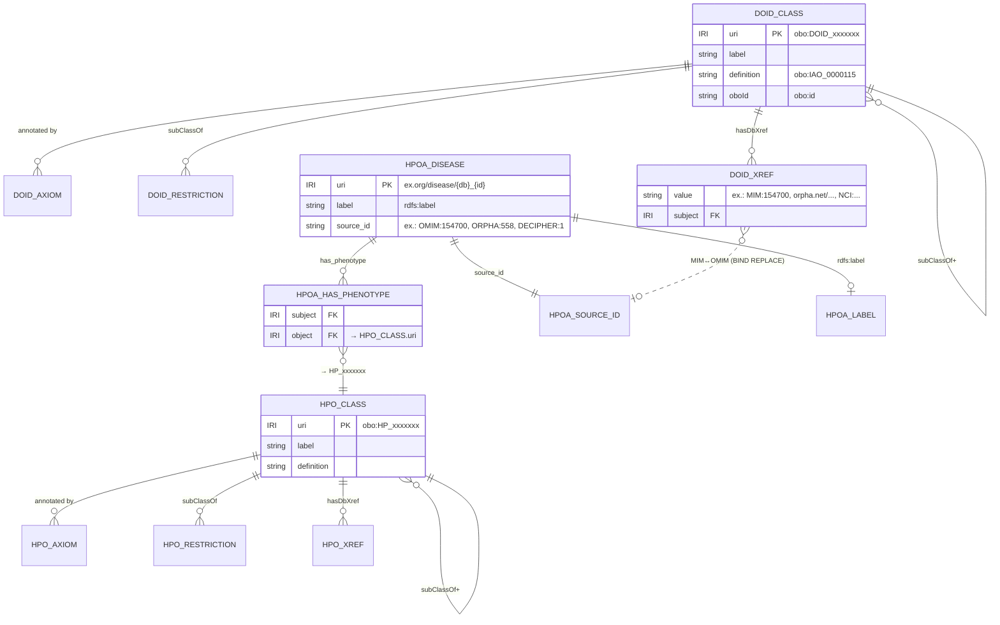
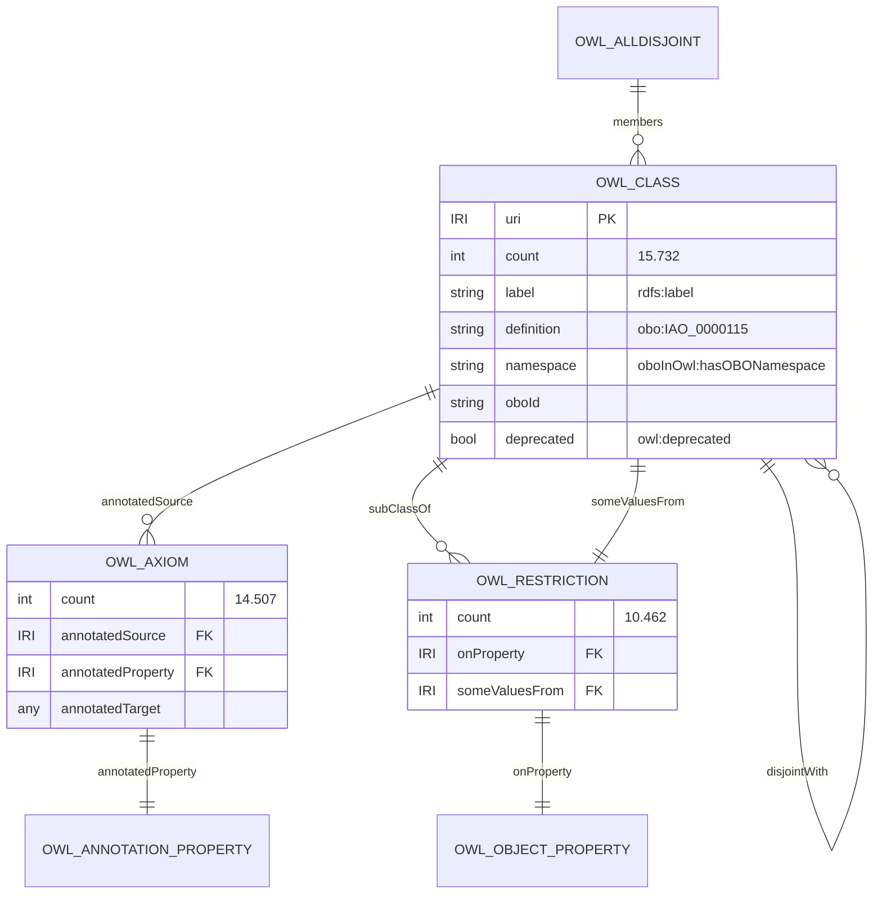
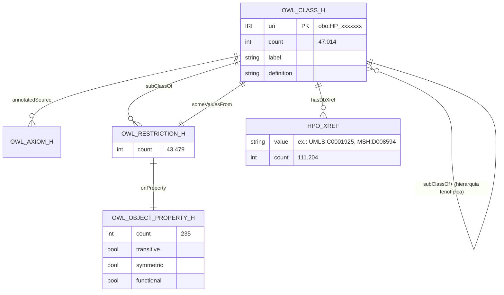
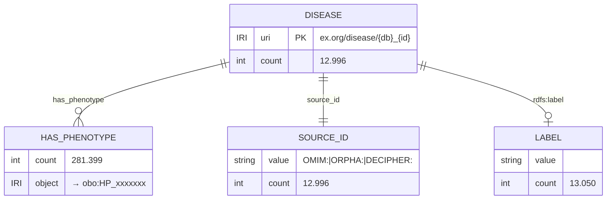

# ERD — BioSPARQL-NL

> Camada de dados é **RDF triple store** (Apache Jena Fuseki 6.0.0 / TDB2), não relacional.
> ERD adaptado: classes OWL → entidades; predicados → relacionamentos; named graphs → contextos isolados.
> Endpoint: `http://localhost:3030/biomedical/sparql` (read-only via SPARQL 1.1).

🟢 CONFIRMADO — extraído de `data/schemas.json` (introspecção SPARQL via `src/utils/schema_extractor.py`).

---

## 1. Topologia geral (named graphs + datasets auxiliares)



---

## 2. ERD — entidades centrais (vista relacional simplificada)



---

## 3. ERD — `urn:doid` (detalhe interno)



---

## 4. ERD — `urn:hpo` (detalhe interno)



---

## 5. ERD — `urn:hpoa` (detalhe interno, schema mínimo)



---

## 6. Cross-graph join — DOID ↔ HPOA ↔ HPO

```mermaid
sequenceDiagram
    participant Q as Query SPARQL
    participant D as urn:doid
    participant A as urn:hpoa
    participant P as urn:hpo

    Q->>D: SELECT ?xref WHERE { ?d oboInOwl:hasDbXref ?xref<br/>FILTER STRSTARTS(?xref,"MIM:") }
    D-->>Q: "MIM:154700"
    Q->>Q: BIND(REPLACE(?xref,"^MIM:","OMIM:") AS ?omim)
    Q->>A: ?disease hpoa:source_id ?omim ;<br/>hpoa:has_phenotype ?pheno
    A-->>Q: ?pheno = obo:HP_0001166
    Q->>P: ?pheno rdfs:label ?phenotype_label
    P-->>Q: "Arachnodactyly"
```

🟡 INFERIDO — apenas `BIND(REPLACE(...))` foi confirmado em queries do gold standard (Q21). Direção inversa (`OMIM→MIM`) também é válida via `CONCAT`.
