# Relacionamentos — BioSPARQL-NL

> RDF não tem FK; relações = predicados. Aqui mapeio cada tipo de ligação, cardinalidade, direção e mecanismo de join.

🟢 CONFIRMADO via inspeção de `data/schemas.json` + queries do gold standard (`data/gold_standard/questions.json`).

---

## 1. Cross-graph: DOID ↔ HPOA (via xref MIM/OMIM)

| Origem | Predicado | Alvo | Cardinalidade | Mecanismo |
| --- | --- | --- | --- | --- |
| `urn:doid` ?d → ?xref | `oboInOwl:hasDbXref` | string `"MIM:xxxxxx"` | 1:N (uma doença DOID, vários xrefs) | filtro `STRSTARTS(?xref,"MIM:")` |
| string `"OMIM:xxxxxx"` | — | `urn:hpoa` ?disease (`hpoa:source_id`) | 1:1 (chave única) | `BIND(REPLACE(?xref,"^MIM:","OMIM:") AS ?omim)` |

**Regra crítica:** prefixos divergem entre grafos — DOID emite `MIM:`, HPOA armazena `OMIM:`. Sempre normalizar via `REPLACE` antes do match. Ver `business-rules.md` §1 e `_reversa_sdd/adrs/001-bind-replace-para-join-doid-hpoa.md`.

**Exemplo (Q21 do gold standard):**
```sparql
GRAPH <urn:doid> {
  ?doid_class oboInOwl:hasDbXref ?xref .
  FILTER(STRSTARTS(STR(?xref), "MIM:"))
}
BIND(REPLACE(STR(?xref), "^MIM:", "OMIM:") AS ?omim_id)
GRAPH <urn:hpoa> {
  ?disease hpoa:source_id ?omim_id .
}
```

---

## 2. Cross-graph: HPOA → HPO (via OBO URI)

| Origem | Predicado | Alvo | Cardinalidade | Mecanismo |
| --- | --- | --- | --- | --- |
| `urn:hpoa` `hpoa:Disease` | `hpoa:has_phenotype` | `urn:hpo` `owl:Class` (`obo:HP_xxxxxxx`) | N:M | URI direto (sem rewrite) |

**Volumes:** 12.996 doenças × 281.399 ligações `has_phenotype` ⇒ ~21,7 fenótipos por doença em média.
**Sem necessidade de transformação:** `hpoa_to_rdf.py` constrói o URI alvo no formato `http://purl.obolibrary.org/obo/HP_{id}` que casa diretamente com o sujeito de `urn:hpo`.

**Exemplo (Q01):**
```sparql
GRAPH <urn:hpoa> {
  ?disease hpoa:source_id "OMIM:154700" ;
           hpoa:has_phenotype ?pheno .
}
GRAPH <urn:hpo> {
  ?pheno rdfs:label ?phenotype_label .
}
```

---

## 3. Cross-graph: DOID → HPOA → HPO (3-way join)

Composição dos relacionamentos #1 e #2. Usado em queries que partem de uma doença descrita em DOID e querem listar fenótipos via anotações HPOA. Padrão `GRAPH_JOIN_3WAY`.

```mermaid
flowchart LR
    DOID["DOID class<br/>obo:DOID_10595"]
    XREF["xref MIM:154700"]
    OMIM["OMIM:154700"]
    HPOAD["HPOA Disease<br/>ex.org/disease/OMIM_154700"]
    HPOC["HPO Class<br/>obo:HP_0001166"]
    LABEL["label 'Arachnodactyly'"]

    DOID -- "oboInOwl:hasDbXref" --> XREF
    XREF -. "BIND REPLACE MIM→OMIM" .-> OMIM
    OMIM -- "hpoa:source_id (literal)" --> HPOAD
    HPOAD -- "hpoa:has_phenotype" --> HPOC
    HPOC -- "rdfs:label" --> LABEL
```



**Custo:** consultas 3-way são as mais caras do pipeline (~5x latência média de queries single-graph). Validador permissivo as aceita mesmo com termos desconhecidos.

---

## 4. Intra-grafo `urn:doid` — hierarquia + reificação + xref

| Origem | Predicado | Alvo | Cardinalidade | Notas |
| --- | --- | --- | --- | --- |
| `owl:Class` ?c | `rdfs:subClassOf` | `owl:Class` ?parent | N:M (DAG) | Suporta `+` (fechamento transitivo). `subClassOf+` pode explodir em queries amplas. |
| `owl:Class` ?c | `rdfs:subClassOf` | `owl:Restriction` ?r | 1:N | Restrições anônimas; combinar com `?r owl:onProperty/someValuesFrom`. |
| `owl:Restriction` ?r | `owl:onProperty` | `owl:ObjectProperty` ?p | 1:1 | Define propriedade da restrição existencial. |
| `owl:Restriction` ?r | `owl:someValuesFrom` | `owl:Class` ?c2 | 1:1 | Define alvo da restrição (∃). |
| `owl:Class` ?c | `obo:IAO_0000115` | xsd:string | 0..1 | Definição textual. Q03/Q15 dependem disso. |
| `owl:Class` ?c | `oboInOwl:hasExactSynonym` | xsd:string | 0..N | Sinônimos lexicais (Q05). |
| `owl:Class` ?c | `oboInOwl:hasDbXref` | xsd:string | 0..N | Xrefs externos (chave do join cross-graph). |
| `owl:Axiom` ?ax | `owl:annotatedSource/Property/Target` | — | 1:1:1 | Reificação: anota tripla com metadados. |
| `owl:AllDisjointClasses` | `owl:members` | `owl:Class` (lista RDF) | 1:N | Disjuntividade conjunta. |
| `owl:Class` | `skos:exactMatch \| broadMatch \| narrowMatch \| closeMatch \| relatedMatch` | `owl:Class` | N:M | Mapeamentos cross-ontology. |
| `owl:Class` | `owl:equivalentClass` | `owl:Class` | N:M | Equivalência semântica (725 ligações). |

---

## 5. Intra-grafo `urn:hpo` — hierarquia + propriedades lógicas

Estrutura idêntica a `urn:doid`, com extras:

- **Object properties caracterizadas:** 30 transitivas, 7 simétricas, 2 irreflexivas, 1 funcional, 1 inv-funcional, 1 assimétrica. Influenciam reasoning mas o pipeline atual não usa reasoner.
- **Hierarquia fenotípica** muito mais profunda (47K classes vs 15K em DOID).
- Predicado-chave para queries: `rdfs:subClassOf+ obo:HP_0000118` (raiz "Phenotypic abnormality") em Q29.

---

## 6. Intra-grafo `urn:hpoa` — schema mínimo

| Origem | Predicado | Alvo | Cardinalidade |
| --- | --- | --- | --- |
| `hpoa:Disease` | `hpoa:has_phenotype` | IRI (HPO) | 1:N |
| `hpoa:Disease` | `hpoa:source_id` | xsd:string | 1:1 (única) |
| `hpoa:Disease` | `rdfs:label` | xsd:string | 0..1 |

Relacionamento polimórfico via `source_id`: o literal funciona como discriminator (`OMIM:` / `ORPHA:` / `DECIPHER:`). Filtros `STRSTARTS(?source_id, "OMIM:")` permitem subset por fonte (Q13).

---

## 7. Tabelas de junção (analogia relacional)

RDF não usa tabelas de junção; usa triplas. Mas conceitualmente:

| "Tabela de junção" | Mecanismo RDF | Cardinalidade |
| --- | --- | --- |
| `disease_phenotype` | `?d hpoa:has_phenotype ?p` (281K triplas) | N:M materializado |
| `disease_xref` | `?d oboInOwl:hasDbXref ?x` (53K em DOID + 111K em HPO) | 1:N |
| `class_synonym` | `?c oboInOwl:hasExactSynonym/Related/Narrow/Broad ?s` | 1:N |
| `axiom_annotation` | `?ax owl:annotatedSource/Property/Target ?...` | 1:1:1:1 (reificação) |

---

## 8. Relacionamentos polimórficos / discriminator

- **`hpoa:source_id` literal** age como discriminator: `OMIM:` / `ORPHA:` / `DECIPHER:`. Não há tipo RDF distinto por fonte; única forma de filtrar é `STRSTARTS`.
- **`oboInOwl:hasDbXref`** em DOID/HPO comporta vários esquemas de namespace (`MIM:`, `MESH:`, `UMLS_CUI:`, `ICD10CM:`, `orpha.net/...`). Sem tipagem; cliente precisa inspecionar prefixo.

---

## 9. Não há FK enforced

Triple stores não validam integridade referencial. Possível ter:

- `hpoa:Disease` apontando para `hpoa:has_phenotype` sem o objeto existir em `urn:hpo` (HPO obsoletos)
- `oboInOwl:hasDbXref` apontando para `MIM:xxxxxx` que não tem contraparte em `urn:hpoa`

🔴 LACUNA — não há script de validação de integridade cross-graph (vs. obsolete HPO terms ou OMIMs órfãos). Recomendado para auditoria.
