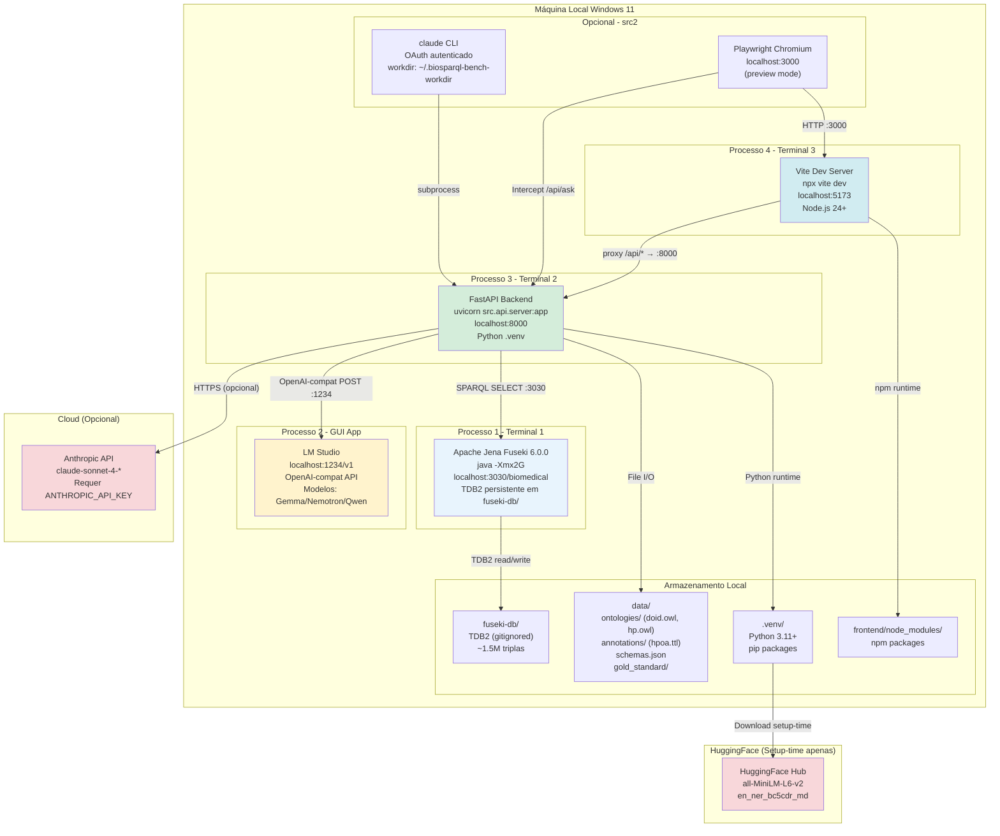

# Deployment — BioSPARQL-NL

> Gerado pelo Arquiteto em 2026-05-04 | doc_level: detalhado
> 🟡 INFERIDO — não há Dockerfile ou docker-compose no projeto; modelo baseado em scripts de startup do CLAUDE.md

---

## Contexto

BioSPARQL-NL é um sistema de pesquisa acadêmica (PPG Computação Aplicada — UNISINOS) executado **localmente em máquina de desenvolvimento**. Não há configuração de cloud, containers Docker ou pipeline de CI/CD. O deployment é manual via 4 terminais.

**Hardware alvo:** Windows 11 Pro com 8GB VRAM + 16GB RAM, Java 21+, Node.js 24+.

---

## Diagrama de Deployment (Infraestrutura Local)



---

## Sequência de Inicialização

```
1. [Java] Fuseki:
   PATH="/c/Program Files/Eclipse Adoptium/jdk-21.0.10.7-hotspot/bin:$PATH"
   MSYS_NO_PATHCONV=1
   java -Xmx2G -jar tools/apache-jena-fuseki-6.0.0/fuseki-server.jar \
     --tdb2 --loc=fuseki-db --update /biomedical
   → Aguardar "Server Fuseki started" em localhost:3030

2. [LM Studio] Abrir GUI, carregar modelo, iniciar servidor em localhost:1234
   → Verificar com: curl http://localhost:1234/v1/models

3. [Python] Backend FastAPI:
   HF_HUB_DISABLE_XET=1 PYTHONPATH=. \
     .venv/Scripts/python.exe -m uvicorn src.api.server:app --port 8000
   → Pipeline lazy-init no primeiro /api/ask (pode demorar 30-60s)

4. [Node.js] Frontend Vite:
   cd frontend && npx vite dev
   → Abrir http://localhost:5173

5. [Opcional] Playwright:
   → Alterar Vite para porta 3000 OU usar preview build
   → PYTHONPATH=. .venv/Scripts/python.exe -m src2.evaluation.playwright_runner
```

---

## Configuração de Ambiente

### Variáveis de Ambiente (.env)

| Variável | Padrão | Descrição |
|---|---|---|
| `ANTHROPIC_API_KEY` | — | API key para AnthropicBackend (opcional) |
| `LLM_MODEL` | `auto` | Modelo LLM no LM Studio |
| `LLM_TIMEOUT` | `300` | Timeout de geração LLM em segundos |
| `LLM_MAX_TOKENS` | `3000` | Máx tokens na resposta LLM |
| `BIOSPARQL_NER_BACKEND` | `scispacy` | Backend NER padrão |
| `HF_HUB_DISABLE_XET` | — | Desativa XET transfer no HuggingFace |

### Portas

| Serviço | Porta | Protocolo |
|---|---|---|
| Apache Jena Fuseki | 3030 | HTTP SPARQL |
| LM Studio | 1234 | HTTP OpenAI-compat |
| FastAPI Backend | 8000 | HTTP REST |
| Vite Dev Server | 5173 | HTTP (proxy) |
| Playwright target | 3000 | HTTP (preview) |

---

## Requisitos de Hardware

| Recurso | Mínimo | Recomendado |
|---|---|---|
| VRAM | 4GB | 8GB (para modelos 4B) |
| RAM | 16GB | 32GB |
| Armazenamento | 20GB | 50GB (ontologias + modelos) |
| Java | 21+ | Eclipse Adoptium JDK 21 |
| Python | 3.11+ | 3.11 |
| Node.js | 20+ | 24 |

**Limitação conhecida:** Modelos >20B parâmetros requerem verificação manual de memória disponível antes de carregar no LM Studio (RN-09).

---

## Dados Pré-carregados (setup-time)

| Dado | Tamanho aproximado | Comando de carga |
|---|---|---|
| `doid.owl` → `urn:doid` | ~302K triplas | Fuseki startup via TDB2 |
| `hp.owl` → `urn:hpo` | ~908K triplas | Fuseki startup via TDB2 |
| `hpoa.ttl` → `urn:hpoa` | ~320K triplas | Fuseki startup via TDB2 |
| `data/schemas.json` | ~50KB | `python -m src.utils.schema_extractor` |
| `data/gold_standard/questions.index` | ~50KB | `python -m src.utils.index_builder` |
| scispaCy `en_ner_bc5cdr_md` | ~200MB | `pip install` + `python -m spacy download` |
| sentence-transformers `all-MiniLM-L6-v2` | ~90MB | HuggingFace Hub (auto-download) |

---

## Não há (por design)

| Item | Motivo |
|---|---|
| Docker / docker-compose | Sistema de pesquisa local, não containerizado |
| CI/CD pipeline | Execução manual (nenhum `.github/workflows`) |
| HTTPS / TLS | Deployment local apenas |
| Autenticação de usuário | Sistema single-user acadêmico |
| Balanceamento de carga | Single-instance por design |
| Banco de dados relacional | Triplestore RDF substitui RDBMS |
