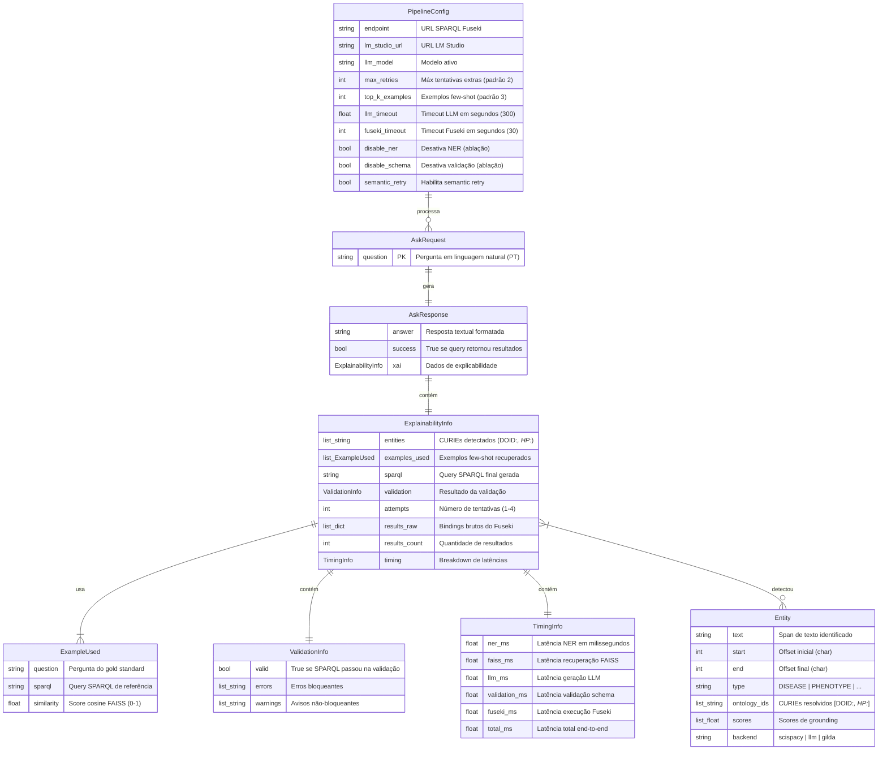
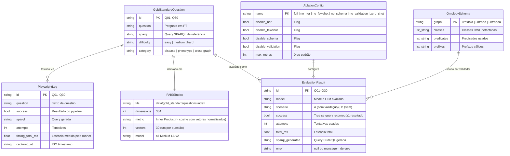

# ERD Completo — BioSPARQL-NL

> Gerado pelo Arquiteto em 2026-05-04 | doc_level: detalhado

---

## Nota sobre o modelo de dados

BioSPARQL-NL não usa banco de dados relacional. Seu "modelo de dados" é composto de:

1. **Entidades de runtime** — dataclasses Python em memória (sem persistência entre requests)
2. **Entidades RDF** — triplas no triplestore Fuseki (DOID, HPO, HPOA)
3. **Arquivos estáticos** — JSON/FAISS/binary (dados de configuração e golden standard)

Este ERD documenta as estruturas de dados do sistema, seus atributos e relacionamentos.

---

## ERD — Entidades de Runtime (Python)



---

## ERD — Dados Estáticos (Arquivos)



---

## ERD — Grafos RDF no Fuseki (Modelo Ontológico)

```mermaid
erDiagram
    DoidDisease {
        uri uri PK "http://purl.obolibrary.org/obo/DOID_*"
        string rdfs_label "Nome da doença (EN)"
        string obo_def "Definição OBO"
        uri rdf_type "obo:DOID_4 (Disease)"
        string hasDbXref "MIM:* | OMIM:* | ICD:* (literal)"
    }

    HpoTerm {
        uri uri PK "http://purl.obolibrary.org/obo/HP_*"
        string rdfs_label "Nome do fenótipo (EN)"
        uri rdf_type "obo:HP_0000118 (HumanPhenotype)"
        uri subClassOf "Hierarquia HPO"
    }

    HpoaAnnotation {
        uri disease_uri PK_FK "URI da doença (OMIM/ORPHA)"
        uri phenotype_uri PK_FK "URI do fenótipo HP_*"
        string source_id "OMIM:* (literal — incompatível com MIM: do DOID)"
        string aspect "P (phenotype) | I (inheritance)"
        string evidence "HP:0040279 (frequência)"
        string rdfs_label "Label da doença no contexto HPOA"
    }

    DoidDisease ||--o{ HpoaAnnotation : "referenciado via MIM:→OMIM: (BIND+REPLACE)"
    HpoTerm ||--o{ HpoaAnnotation : "hpoa:has_phenotype"
```

---

## Grafo de Namespaces Ativos

| Prefixo | Namespace | Grafo | Descrição |
|---|---|---|---|
| `obo:` | `http://purl.obolibrary.org/obo/` | `urn:doid`, `urn:hpo` | Classes OBO |
| `oboInOwl:` | `http://www.geneontology.org/formats/oboInOwl#` | `urn:doid` | Xrefs e sinonímia |
| `hpoa:` | `http://purl.obolibrary.org/obo/hp/` | `urn:hpoa` | Predicados de anotação |
| `rdfs:` | `http://www.w3.org/2000/01/rdf-schema#` | todos | label, subClassOf |
| `rdf:` | `http://www.w3.org/1999/02/22-rdf-syntax-ns#` | todos | type |
| `owl:` | `http://www.w3.org/2002/07/owl#` | `urn:doid`, `urn:hpo` | Class, AnnotationProperty |
| `xsd:` | `http://www.w3.org/2001/XMLSchema#` | todos | tipos literais |

**Prefixos inválidos (alucinados por LLMs — removidos pelo pós-processamento):**
- `doid:` — não existe no triplestore
- `hpo:` — não existe no triplestore
