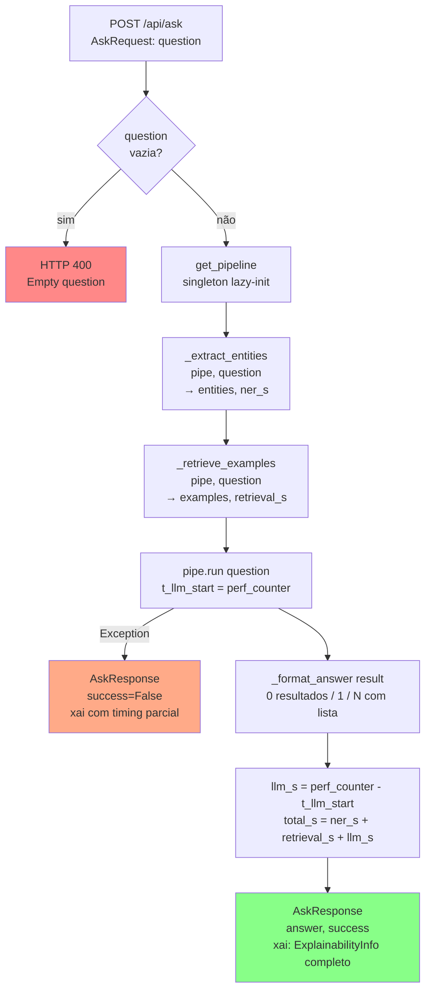
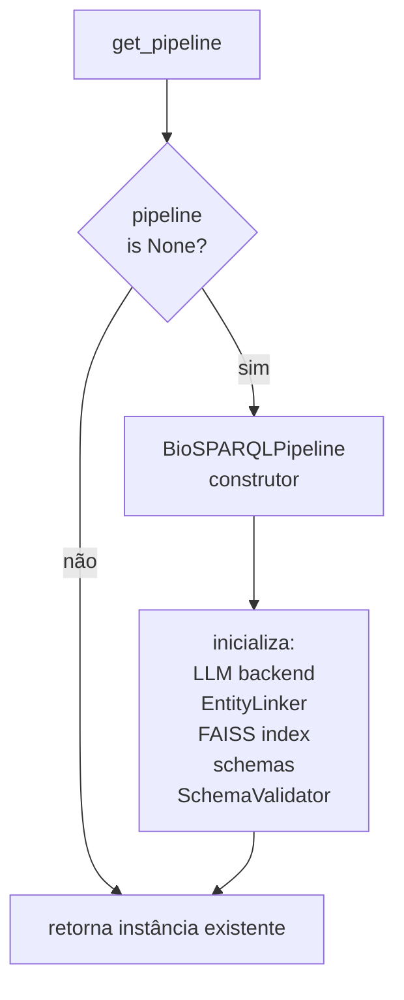

# Flowchart — Módulo `api`

> Gerado pelo Arqueólogo em 2026-05-04

## Fluxo `POST /api/ask`



## Inicialização do Pipeline (singleton)



## Formatação da resposta NL (`_format_answer`)

```
count == 0  → "Nenhum resultado encontrado."
count == 1  → "Resultado: val1 | val2 | ..."
count > 1   → "Encontrados N resultados:\n- val1 | val2\n- ..."
```
