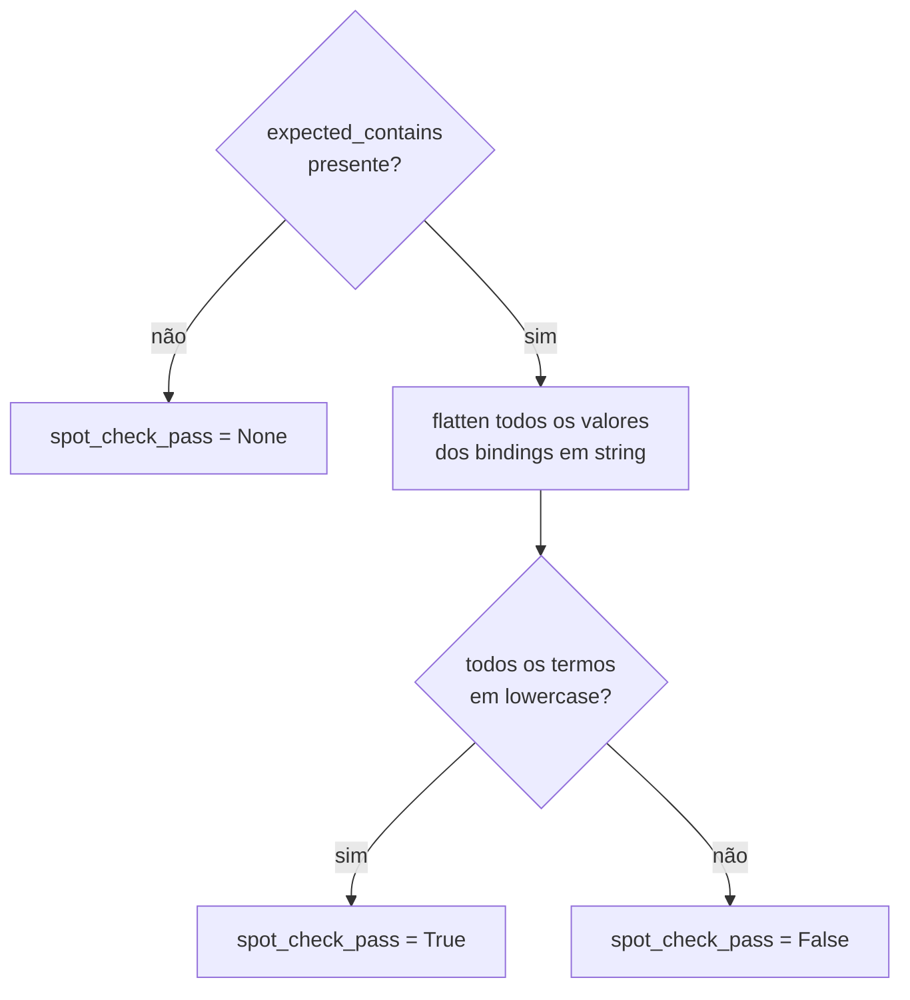
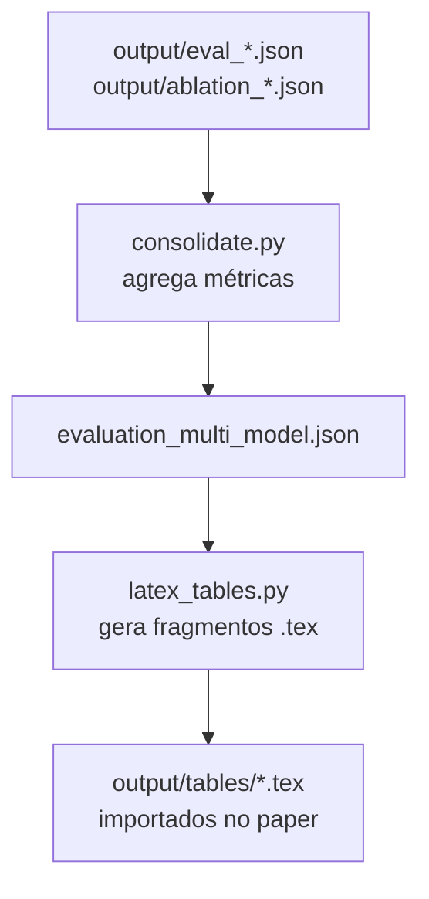

# Flowchart — Módulo `evaluation`

> Gerado pelo Arqueólogo em 2026-05-04

## Avaliação single-model

```mermaid
flowchart TD
    START[run_evaluation.py\n--model --backend] --> LOAD[BioSPARQLPipeline\ncarregar modelo]
    LOAD --> QS[questions.json\n30 questões]
    QS --> SCENARIO_A[Cenário A\nCOM validação\nmax_retries=2]
    QS --> SCENARIO_B[Cenário B\nSEM validação\nmax_retries=0]

    SCENARIO_A --> LOOP_A[para cada questão:\npipe.run question]
    SCENARIO_B --> LOOP_B[para cada questão:\npipe.run question]

    LOOP_A --> METRICS_A[métricas:\nvalid, exec.success, count\nattempts, time_seconds\nmeets_expected, spot_check_pass]
    LOOP_B --> METRICS_B[idem]

    METRICS_A & METRICS_B --> SAVE[output/eval_{safe_model}.json]
```

## Spot-check semântico



## Ablação (6 configurações)

```mermaid
flowchart LR
    FULL[full\nNER+FEW+SCH+VAL] --> A1
    NO_NER[no_ner\n-NER] --> A1
    NO_FEW[no_fewshot\n-Few-shot] --> A1
    NO_SCH[no_schema\n-Schema] --> A1
    NO_VAL[no_validation\n-Validação] --> A1
    ZERO[zero_shot\nnada] --> A1

    A1[run_ablation.py\npara cada config] --> EVAL[evaluate pipeline\n30 questões]
    EVAL --> OUT[output/ablation_{model}.json]
```

## Consolidação e tabelas LaTeX


