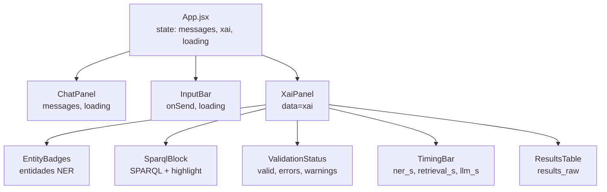
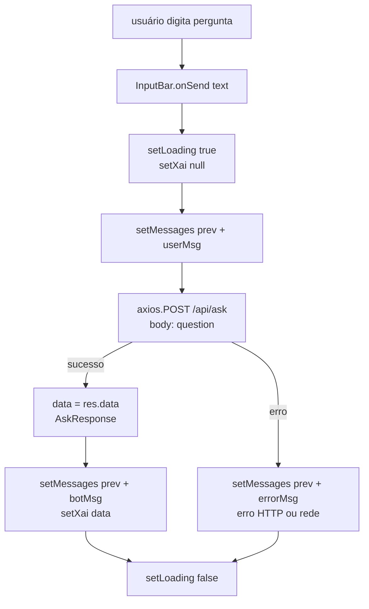

# Flowchart — Módulo `frontend`

> Gerado pelo Arqueólogo em 2026-05-04

## Hierarquia de componentes e estado



## Fluxo de interação



## Layout visual

```
┌─ Header: BioSPARQL-NL ──────────────────────────────────────────┐
│ body                                                             │
│  ┌─ chatArea (flex:1) ──────┐  ┌─ xaiArea (420px) ──────────┐  │
│  │ ChatPanel                │  │ XaiPanel                    │  │
│  │  user: ...               │  │  EntityBadges               │  │
│  │  bot: ...                │  │  SparqlBlock (highlight)    │  │
│  │                          │  │  ValidationStatus           │  │
│  │ InputBar                 │  │  TimingBar                  │  │
│  │  [pergunta...]  [Enviar] │  │  ResultsTable               │  │
│  └──────────────────────────┘  └─────────────────────────────┘  │
└─────────────────────────────────────────────────────────────────┘
```

Proxy Vite: `/api/*` → `http://localhost:8000` (configurado em `vite.config.js`).
