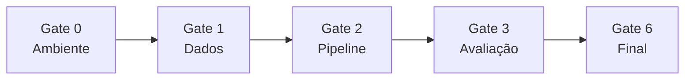

# Flowchart — Módulo `gates`

> Gerado pelo Arqueólogo em 2026-05-04

## Sequência de gates

## Gate 0 — Ambiente (`gate0_check.py`)

Verifica:
- Python libs: owlready2, rdflib, SPARQLWrapper, sentence-transformers, faiss, fastapi, uvicorn, pytest, openai
- scispaCy: `en_core_sci_sm` carregável
- Ollama: `http://localhost:11434/api/tags` + modelo qwen/llama disponível
- Java: `java -version`
- Fuseki: jar presente em `tools/apache-jena-fuseki-6.0.0/`

## Gate 1 — Dados (`gate1_check.py`)

Verifica existência e integridade de:
- `data/ontologies/doid.owl`, `hp.owl`
- `data/annotations/hpoa.ttl`, `phenotype.hpoa`
- `data/schemas.json`
- `data/gold_standard/questions.json` (30 questões)
- `data/gold_standard/questions.index` (FAISS)

## Gate 2 — Pipeline (`gate2_check.py`)

Verifica:
- FastAPI acessível (`GET /api/health` → `{"status":"ok"}`)
- `BioSPARQLPipeline` instanciável sem erros
- Fuseki acessível com query de teste

## Gate 3 — Avaliação (`gate3_check.py`)

Verifica:
- `output/eval_*.json` existem para pelo menos 1 modelo
- Métricas dentro do esperado (correção > threshold)

## Gate 6 — Final (`gate6_check.py`)

Verifica:
- Todos os artefatos de avaliação presentes
- Paper LaTeX compilável (`biosparql-nl.tex`)
