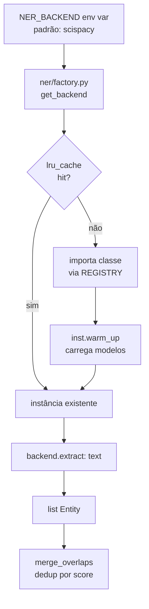
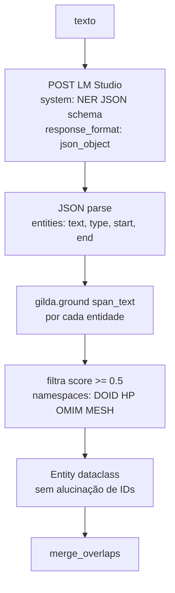

# Flowchart — Módulo `ner`

> Gerado pelo Arqueólogo em 2026-05-04

## Seleção e uso do backend NER



## Backend ScispaCy (padrão)

```mermaid
flowchart TD
    TEXT[texto da pergunta] --> NLP[spacy nlp text\nen_core_sci_sm]
    NLP --> ENTS[doc.ents]
    ENTS --> NOISE{_is_noise?\nlen<4, stopwords,\nratio alfa<0.5}
    NOISE -- sim --> SKIP[descarta span]
    NOISE -- não --> RESOLVE[_resolve via Fuseki\nrdfs:label LCASE match]
    RESOLVE --> FOUND{match?}
    FOUND -- sim --> CURIE[uri → CURIE\nDOID:*, HP:*]
    FOUND -- não --> EMPTY[ontology_ids=[]]
    CURIE & EMPTY --> ENTITY[Entity dataclass]
```

## Backend LLM+Gilda



## EntityLinker — Adapter

```mermaid
flowchart TD
    EL[EntityLinker.extract_entities text] --> BACKEND{_backend?}
    BACKEND -- None --> EMPTY[retorna []]
    BACKEND -- ok --> EXTRACT[backend.extract text]
    EXTRACT --> CONV[_entity_to_dict\nEntity → dict com uri+graph]
    CONV --> FORMAT[format_for_prompt\nlista formatada para LLM]
```
