# Flowchart por Função — `BioSPARQLPipeline._fix_common_errors()`

> Gerado pelo Arqueólogo em 2026-05-04 | doc_level: detalhado
> Arquivo: `src/pipeline/nl_to_sparql.py`

## Pipeline de 8 transformações regex

```mermaid
flowchart TD
    IN([query: str bruta do LLM]) --> T1

    T1["① Remover blocos DECLARE { }
    regex: DECLARE\\s*[\\{\\(]...[\\}\\)]
    preserva linhas PREFIX internas"] --> T2

    T2["② Remover pseudo-keywords soltas
    DECLARE / IMPORT / USE / NAMESPACE
    (remove linha inteira)"] --> T3

    T3["③ Canonicalizar URIs de prefixos
    ex: PREFIX rdfs: <qualquer-uri>
    → PREFIX rdfs: <http://www.w3.org/2000/01/rdf-schema#>
    (9 prefixos conhecidos)"] --> T4

    T4["④a Corrigir oboInOwl#localname
    → oboInOwl:localname
    (não afeta URIs <...>)"] --> T5

    T5["④b Corrigir pred = ?var
    → pred ?var
    (= não é operador de tripla em SPARQL)"] --> T6

    T6["④c Remover PREFIX usando URNs de grafo
    PREFIX doid: <urn:doid>
    PREFIX hpoa: <urn:hpoa>
    → removidos"] --> T7

    T7["⑤ Corrigir URIs de grafo abreviadas
    GRAPH <doid> → GRAPH <urn:doid>
    GRAPH doid:  → GRAPH <urn:doid>
    (idem para hpo, hpoa)"] --> T8

    T8["⑥ Remover asserções rdf:type alucinadas
    ?x a doid:Disease → removido
    doid:Disease → obo:DOID_4
    hpo:HumanPhenotype → obo:HP_0000118"] --> T9

    T9["⑦ Mover FILTERs soltos para dentro do WHERE
    FILTERs após o último } são inválidos (Jena)
    → inseridos antes do último }"] --> T10

    T10["⑧ Corrigir BIND com auto-referência
    BIND(REPLACE(STR(?x),...) AS ?x)
    Jena rejeita: 'Variable already in-scope'
    → renomeia ?x → ?x_mim antes do BIND"] --> OUT

    OUT([query corrigida])
```

## Por que cada correção existe

| # | Problema | Modelo que gerou |
|---|---|---|
| ①② | Pseudo-keywords DECLARE/IMPORT não existem em SPARQL | Vários modelos |
| ③ | URIs de prefixos canônicos variavam entre modelos | Vários modelos |
| ④a | `oboInOwl#` no corpo da query em vez de `oboInOwl:` | Nemotron |
| ④b | `pred = ?var` copiado de SQL | Gemma |
| ④c | Usar `urn:doid` como namespace de prefixo | Vários modelos |
| ⑤ | `GRAPH <doid>` sem namespace `urn:` | Vários modelos |
| ⑥ | `?x a doid:Disease` (prefixo inválido no triplestore) | Vários modelos |
| ⑦ | `FILTER` após `}` — erro de parse Jena | Nemotron |
| ⑧ | `BIND(...?x... AS ?x)` — variável em escopo | Vários modelos |
