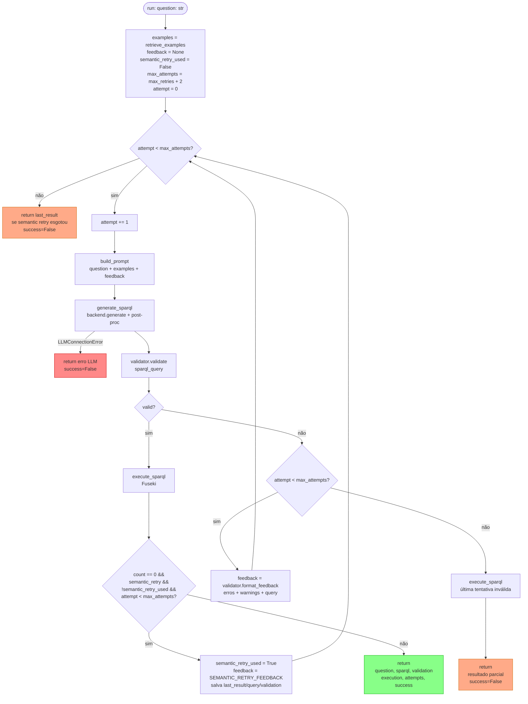

# Flowchart por Função — `BioSPARQLPipeline.run()`

> Gerado pelo Arqueólogo em 2026-05-04 | doc_level: detalhado
> Arquivo: `src/pipeline/nl_to_sparql.py`

## Loop principal de autocorreção

## Semantic retry feedback (constante `SEMANTIC_RETRY_FEEDBACK`)

Quando query é válida sintática/semanticamente mas retorna 0 resultados, o pipeline envia ao LLM:
1. Instrução de usar labels em INGLÊS nos FILTER (febre→fever, etc.)
2. Padrão correto para consultar fenótipos em `urn:hpo` + `urn:hpoa`
3. Padrão correto de JOIN DOID↔HPOA com `BIND(REPLACE(..., "^MIM:", "OMIM:"))`
4. Proibição de usar `doid:`, `hpo:` como prefixos
