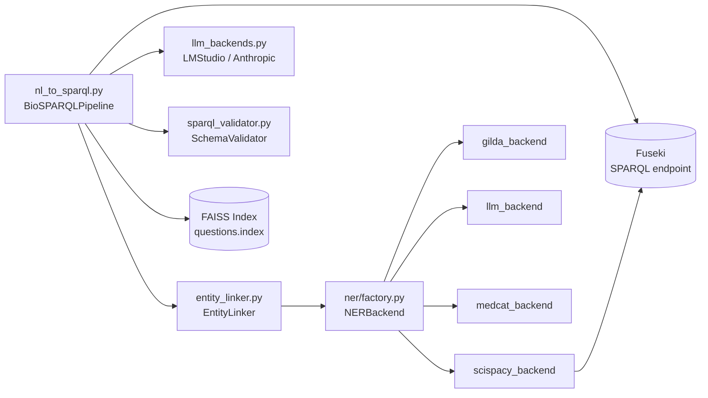

# Flowchart — Módulo `pipeline`

> Gerado pelo Arqueólogo em 2026-05-04

## Visão Geral do Módulo

```mermaid
flowchart TD
    A[Pergunta NL] --> B[BioSPARQLPipeline.run]
    B --> C{FAISS index\ndisponível?}
    C -- sim --> D[retrieve_examples\ntop-k=3 por cosine sim]
    C -- não --> E[exemplos=[]]
    D --> F[build_prompt]
    E --> F
    F --> G[entity_linker.extract_entities\nse não disable_ner]
    G --> H[format_for_prompt\nentidades → texto para LLM]
    F --> I[schema_text\nse não disable_schema]
    F --> J[examples_text\nfew-shot]
    H & I & J --> K[system prompt montado]
    K --> L[generate_sparql\nchamar backend LLM]
    L --> M[_extract_sparql\nmarkdown → SPARQL puro]
    M --> N[_fix_common_errors\n8 transformações regex]
    N --> O[_inject_missing_prefixes\nauto-declarar prefixos]
    O --> P{SchemaValidator\n.validate}
    P -- válido --> Q[execute_sparql\nFuseki + retry]
    Q --> R{count == 0 &&\nsemantic_retry &&\n1ª vez?}
    R -- sim --> S[semantic retry\nfeedback PT→EN]
    S --> F
    R -- não --> T[Resultado final\n✓ success]
    P -- inválido --> U{mais\ntentativas?}
    U -- sim --> V[format_feedback\nerros → LLM]
    V --> F
    U -- não --> W[executar mesmo assim\n⚠ resultado parcial]
```

## Dependências entre componentes


