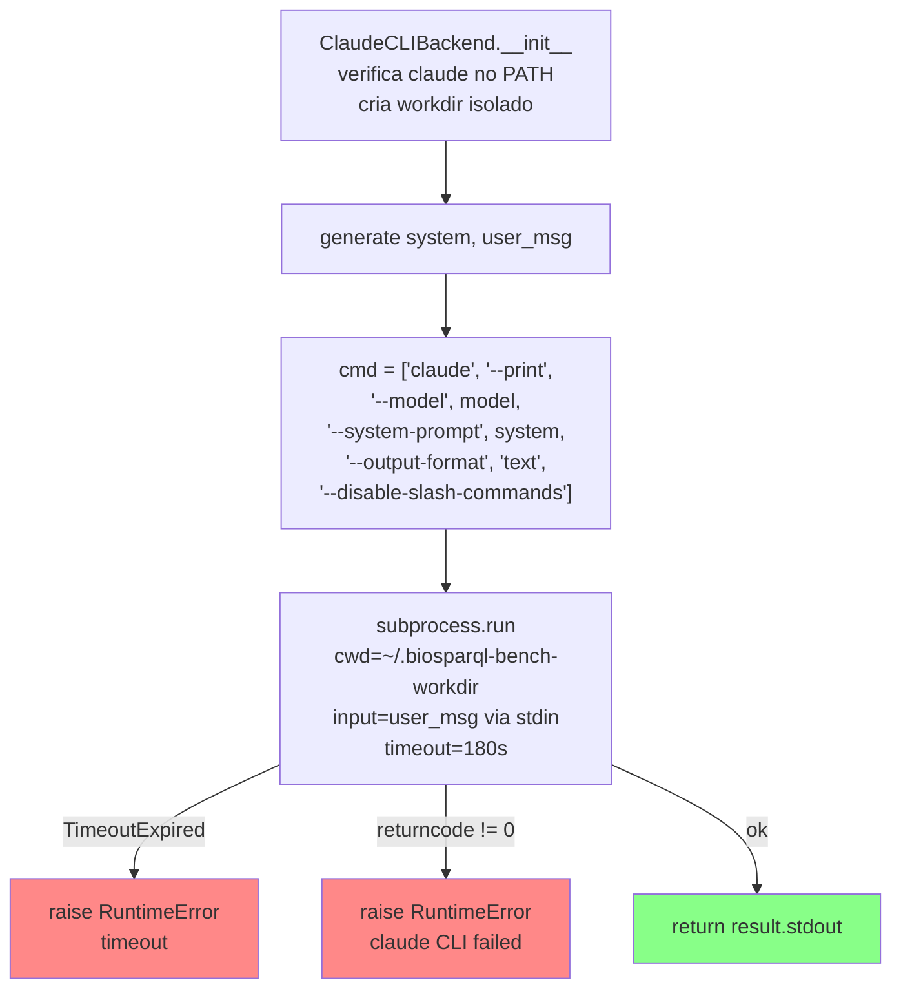
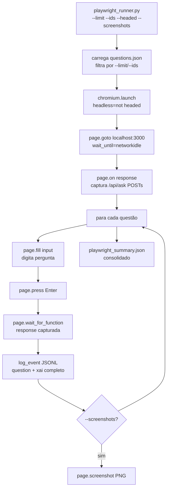
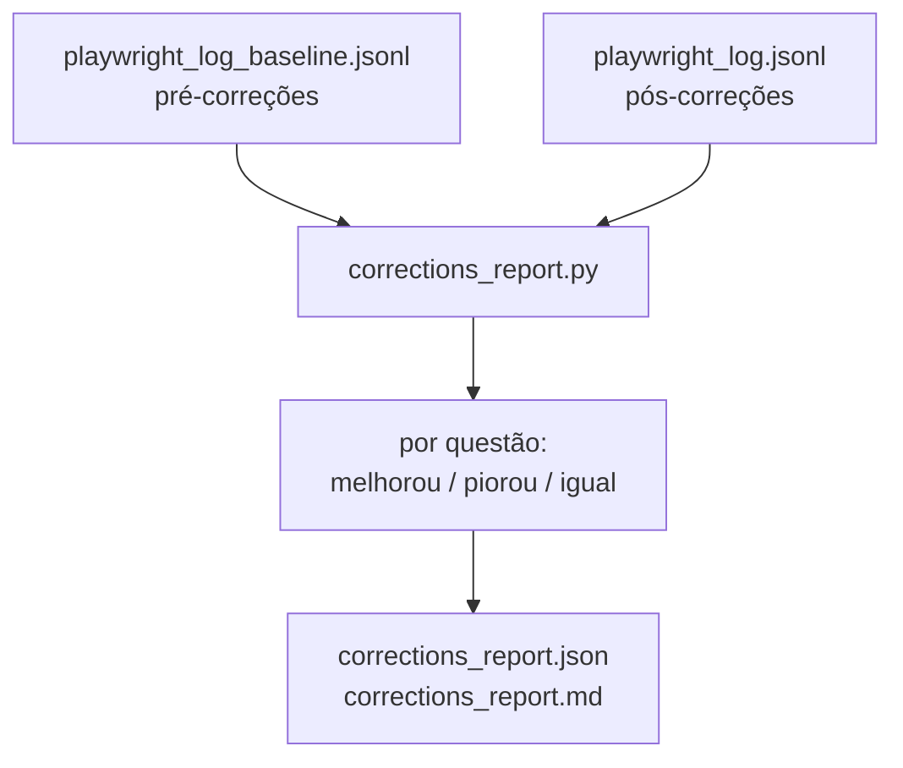

# Flowchart — Módulo `src2`

> Gerado pelo Arqueólogo em 2026-05-04

## ClaudeCLIBackend — geração via subprocess

**Por que workdir isolado?** Claude Code auto-descobre `CLAUDE.md` no diretório de trabalho. Rodar fora de `proj1/` evita que o benchmark seja contaminado pelas instruções do projeto.

## playwright_runner — E2E via browser

## corrections_report — Análise de regressão/progresso

