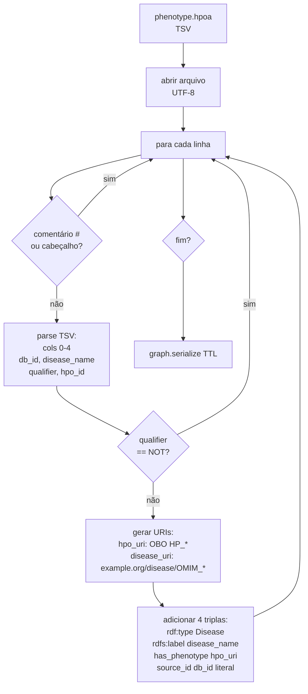
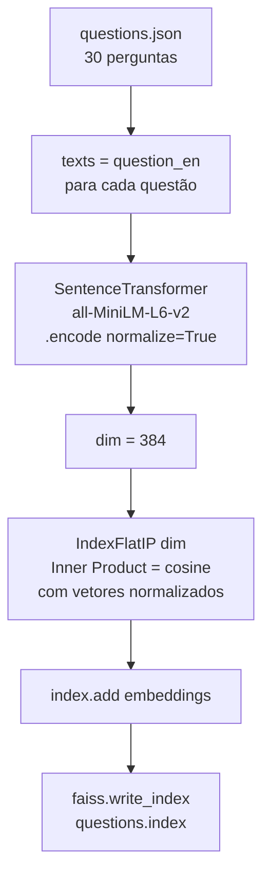
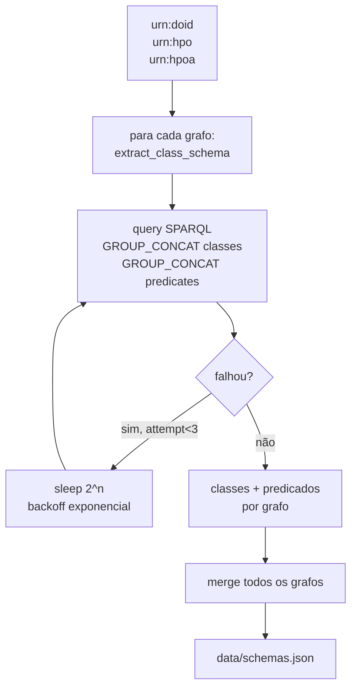

# Flowchart — Módulo `utils`

> Gerado pelo Arqueólogo em 2026-05-04

## hpoa_to_rdf — Conversão TSV→Turtle

```mermaid
flowchart TD
    TSV[phenotype.hpoa\nTSV] --> OPEN[abrir arquivo\nUTF-8]
    OPEN --> LINE[para cada linha]
    LINE --> SKIP_H{comentário #\nou cabeçalho?}
    SKIP_H -- sim --> LINE
    SKIP_H -- não --> PARSE[parse TSV:\ncols 0-4\ndb_id, disease_name\nqualifier, hpo_id]
    PARSE --> SKIP_Q{qualifier\n== NOT?}
    SKIP_Q -- sim --> LINE
    SKIP_Q -- não --> URIS[gerar URIs:\nhpo_uri: OBO HP_*\ndisease_uri: example.org/disease/OMIM_*]
    URIS --> TRIPLES[adicionar 4 triplas:\nrdf:type Disease\nrdfs:label disease_name\nhas_phenotype hpo_uri\nsource_id db_id literal]
    TRIPLES --> LINE
    LINE --> DONE{fim?}
    DONE --> SAVE[graph.serialize TTL]
```

## index_builder — FAISS

```mermaid
flowchart TD
    QS[questions.json\n30 perguntas] --> TEXTS[texts = question_en\npara cada questão]
    TEXTS --> EMB[SentenceTransformer\nall-MiniLM-L6-v2\n.encode normalize=True]
    EMB --> DIM[dim = 384]
    DIM --> FAISS[IndexFlatIP dim\nInner Product = cosine\ncom vetores normalizados]
    FAISS --> ADD[index.add embeddings]
    ADD --> SAVE[faiss.write_index\nquestions.index]
```

## schema_extractor — Introspecção SPARQL

```mermaid
flowchart TD
    GRAPHS[urn:doid\nurn:hpo\nurn:hpoa] --> QUERY[para cada grafo:\nextract_class_schema]
    QUERY --> SPARQL_Q[query SPARQL\nGROUP_CONCAT classes\nGROUP_CONCAT predicates]
    SPARQL_Q --> RETRY{falhou?}
    RETRY -- sim, attempt<3 --> SLEEP[sleep 2^n\nbackoff exponencial]
    SLEEP --> SPARQL_Q
    RETRY -- não --> RESULT[classes + predicados\npor grafo]
    RESULT --> MERGE[merge todos os grafos]
    MERGE --> JSON[data/schemas.json]
```
