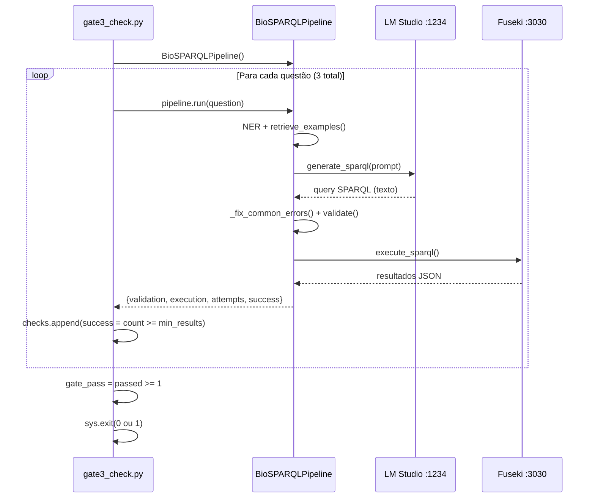

# Design — gates

> Unit: `gates/` | Gerado pelo Redator em 2026-05-04 | doc_level: detalhado

---

## Visão Geral

🟢 **CONFIRMADO** — `gates/gate*.py`

O módulo `gates` é um conjunto de 5 scripts Python independentes que implementam verificações de pré-condição por fase do projeto. São executados manualmente (linha de comando) antes de operações críticas, funcionando como um "pipeline de CI local" sem framework externo.

A numeração é não-contígua: `gate0, gate1, gate2, gate3, gate6`. As posições 4 e 5 não existem no código atual — provavelmente reservadas ou descartadas durante o desenvolvimento.

---

## Arquitetura

### Padrão de estrutura de cada gate

🟢 **CONFIRMADO** — todos os scripts seguem o mesmo padrão

Todos os gates compartilham o mesmo layout estrutural:

```
checks = []                          # lista de tuplas (nome, bool, detalhe)

# Seção de verificações
# --------------------------
# <verificação>
try:
    <lógica>
    checks.append(("<nome>", True, "<detalhe>"))
except Exception as e:
    checks.append(("<nome>", False, str(e)))

# Resultado
print("=" * 60)
print("GATE N — <título>")
for name, ok, detail in checks:
    status = "[OK]" if ok else "[FAIL]"
    print(f"  {status} {name}: {detail}")

all_pass = all(ok for _, ok, _ in checks)
print(f"{'[OK] GATE N PASSED' if all_pass else '[FAIL] GATE N FAILED'}")
sys.exit(0 if all_pass else 1)
```

### Dependências entre gates

🟢 **CONFIRMADO** — scripts isolados sem estado compartilhado

```
Gate 0 (ambiente)
  └── Gate 1 (dados Fuseki)        ← depende de Fuseki rodando (gate0 verifica binary)
        └── Gate 2 (gold/schema)   ← depende de dados e schemas prontos
              └── Gate 3 (pipeline E2E) ← depende de dados e backend LLM
                    └── Gate 6 (API/frontend) ← depende do código estar correto
```

A sequência é **convenção documentada**, não imposição técnica. Cada script pode ser executado isoladamente.

---

## Fluxo Detalhado por Gate

### Gate 0 — Ambiente (`gate0_check.py`)

🟢 **CONFIRMADO**

```
Importação dinâmica de cada lib Python
  → __import__(import_name) → captura ImportError
  → checks.append(lib, ok, versão)

spacy.load("en_core_sci_sm")
  → OSError se modelo ausente

requests.get("http://localhost:11434/api/tags", timeout=5)
  → verifica modelos Ollama (legado!)
  → any("qwen" in m or "llama" in m for m in models)

subprocess.run(["java", "-version"], ...)
  → extrai versão de stderr (java escreve versão em stderr, não stdout)

subprocess.run(["node", "--version"], ...)
subprocess.run(["npm.cmd", "--version"], ...)    ← .cmd necessário no Windows

subprocess.run(["pdflatex", "--version"], ...)

glob.glob("tools/apache-jena-fuseki-*/fuseki-server.bat")
  → detecta qualquer versão do Fuseki em tools/
```

**Atenção:** O check de LLM verifica Ollama (porta 11434), mas o sistema atual usa LM Studio (porta 1234). Este check passará `False` em ambientes de produção onde apenas LM Studio está instalado.

---

### Gate 1 — Dados (`gate1_check.py`)

🟢 **CONFIRMADO**

```
SPARQLWrapper → ENDPOINT = "http://localhost:3030/biomedical/sparql"

Query 1: COUNT(*) por grafo
  → {g: count} para urn:doid, urn:hpo, urn:hpoa
  → min: 150k / 400k / 50k

Query 2: Marfan phenotypes (cross-graph HPOA × HPO)
  → GRAPH <urn:hpoa> { ?disease hpoa:source_id "OMIM:154700" ... }
  → GRAPH <urn:hpo> { ?pheno rdfs:label ... }
  → min 5 resultados

Query 3: DOID diseases (subclasses de DOID_4)
  → rdfs:subClassOf+ obo:DOID_4
  → min 8.000

Query 4: DOID hasDbXref com prefixo MIM: ou OMIM:
  → FILTER(STRSTARTS(..., "MIM:") || STRSTARTS(..., "OMIM:"))
  → min 100

Query 5: Cross-graph DOID ↔ HPOA (join MIM:154700)
  → verifica que JOIN por xref funciona
  → FILTER(?xref = "MIM:154700" || ?xref = "OMIM:154700")
  → min 1 resultado
```

---

### Gate 2 — Schemas, Gold Standard e FAISS (`gate2_check.py`)

🟢 **CONFIRMADO** (com dois bugs documentados)

```
schemas.json
  → json.load() → verifica classes > 0 e predicados > 0 por grafo

questions.json
  → len(qs) >= 50   ← BUG: arquivo tem 30 questões → este check sempre falhará
  → distribuição: easy >= 10, medium >= 10, hard >= 10
  → campos obrigatórios: {id, question_pt, question_en, sparql, type, difficulty, expected_min_results}
  → IDs únicos
  → sintaxe SPARQL: rdflib.plugins.sparql.parser.parseQuery(q["sparql"])

FAISS index
  → faiss.read_index("data/gold_standard/questions.index")
  → index.ntotal >= 50   ← BUG: index tem 30 vetores → este check sempre falhará

Retrieval test
  → SentenceTransformer("all-MiniLM-L6-v2")
  → encode("What symptoms does Marfan syndrome have?", normalize=True)
  → index.search(query, k=3) → I[0][0] deve ser Q01
```

---

### Gate 3 — Pipeline E2E (`gate3_check.py`)

🟢 **CONFIRMADO**

```
BioSPARQLPipeline()   ← instância real (não mock)

Para cada (question, difficulty, min_results):
  r = pipeline.run(question)
  valid  = r["validation"]["valid"]
  executed = r["execution"]["success"]
  count  = r["execution"]["count"]
  success = executed and count >= min_results

passed_questions = sum(1 for r in results if r.get("success"))
gate_pass = passed_questions >= 1   ← threshold leniente (1/3 é suficiente)
```

**Observação de design:** O threshold `>= 1` é deliberadamente baixo para permitir que o gate passe mesmo com modelos 4B que têm taxa de sucesso de ~50%. Ver `questions.md` para discussão sobre threshold ideal.

---

### Gate 6 — API + Frontend (`gate6_check.py`)

🟢 **CONFIRMADO**

```
import fastapi, uvicorn   ← verifica instalação

from src.api.server import app   ← importação sem servidor real

TestClient(app)   ← ASGI test client, não real HTTP

client.get("/api/health") → status 200
client.post("/api/ask", json={"question": "What is disease DOID_4?"}) → 200
  → xai.sparql não-vazio
  → xai.timing.total_s presente
  → xai.entities é lista
  → xai.validation.valid presente

client.post("/api/ask", json={"question": ""}) → 400

subprocess.run(["npx.cmd", "vite", "build"], cwd="frontend", timeout=60)
  → exit code 0
```

---

## Decisões de Design

### DD-01 — Sem framework de CI/CD
🟡 **INFERIDO** — ausência de pytest markers, Makefile ou workflow YAML nos gates

Os gates são scripts Python simples sem dependência de pytest, make ou GitHub Actions. Isso torna o bootstrap trivial mas limita a integração com pipelines automatizados. A integração CI ficaria em `.github/workflows/` se implementada.

### DD-02 — TestClient em vez de servidor real no gate6
🟢 **CONFIRMADO** — `fastapi.testclient.TestClient` não sobe servidor HTTP

O gate6 usa `TestClient` (ASGI in-process), que não requer porta de rede. Isso significa que o gate verifica o **código** da API mas não verifica o servidor em execução real. Um servidor com falha de bind de porta passaria no gate6.

### DD-03 — Check de Ollama (legacy) em gate0
🟡 **INFERIDO** — comparação entre gate0 e CLAUDE.md (sistema usa LM Studio)

Gate0 foi escrito quando o sistema usava Ollama. Após a migração para LM Studio, o check não foi atualizado. O check de "LLM model" em gate0 sempre falhará em ambientes com apenas LM Studio instalado.

### DD-04 — Threshold leniente em gate3 (1/3 perguntas)
🟢 **CONFIRMADO** — `gate3_check.py:linha 74` comentário explícito

```python
gate_pass = passed_questions >= 1  # At least 1/3 with current small model
```

O threshold foi escolhido para acomodar modelos 4B que têm taxa de sucesso ~50% nas 30 questões do gold standard.

---

## Entidades e Tipos

### Tupla de check (sem classe formal)

🟢 **CONFIRMADO** — todos os gates usam a mesma estrutura inline

```python
checks: list[tuple[str, bool, str]]
# (nome_do_check, passou, detalhe_textual)
```

Não existe uma classe `CheckResult` — a estrutura é uma tupla simples, intencional para manter os scripts zero-dependency de módulos internos.

---

## Integrações Externas

| Integração | Gate | Protocolo | URL / Comando | Confiança |
|---|---|---|---|---|
| Ollama | Gate 0 | HTTP GET | `http://localhost:11434/api/tags` | 🟡 (legado) |
| Apache Jena Fuseki | Gate 1, Gate 3 (via pipeline) | SPARQL/HTTP | `http://localhost:3030/biomedical/sparql` | 🟢 |
| LM Studio (via pipeline) | Gate 3 | OpenAI-compat HTTP | `http://localhost:1234/v1` | 🟢 |
| Java runtime | Gate 0 | subprocess | `java -version` | 🟢 |
| Node.js / npm | Gate 0, Gate 6 | subprocess | `node --version`, `npm.cmd` | 🟢 |
| pdflatex (MiKTeX) | Gate 0 | subprocess | `pdflatex --version` | 🟢 |
| Vite (frontend build) | Gate 6 | subprocess | `npx.cmd vite build` | 🟢 |

---

## Diagrama de Sequência — Gate 3 (mais complexo)


