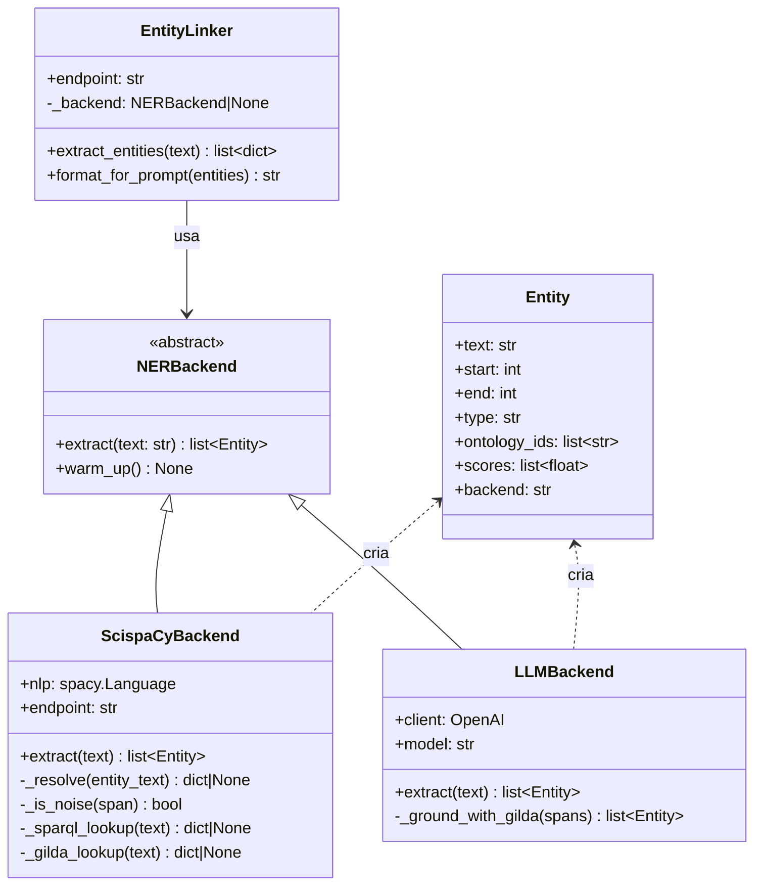
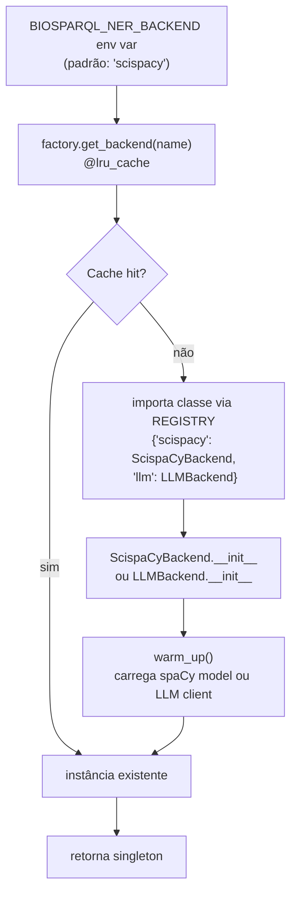
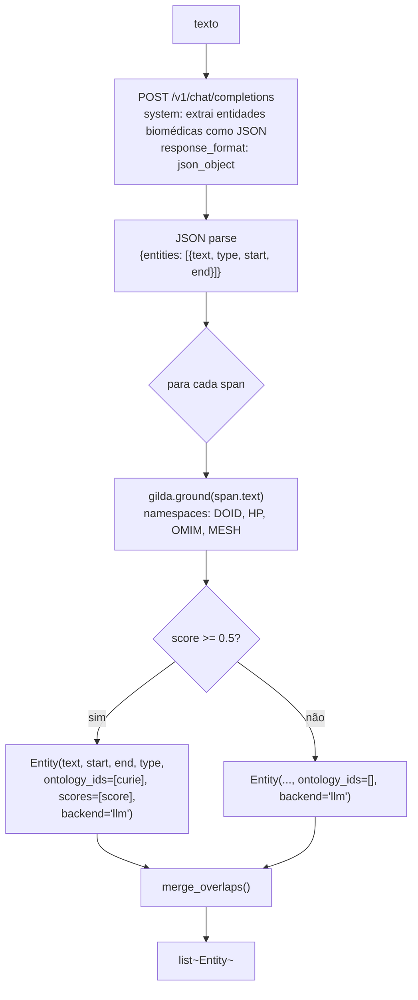
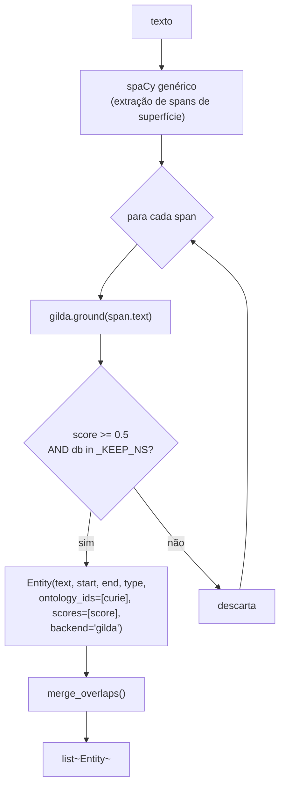

# Design — ner

> Unit: `src/pipeline/ner/` | Gerado pelo Redator em 2026-05-04 | doc_level: detalhado

---

## Visão Geral

O módulo `ner` implementa extração plugável de entidades biomédicas. Seu design segue o padrão **Strategy**: uma interface comum (`NERBackend.extract()`) com múltiplas implementações intercambiáveis via factory com cache singleton. O fluxo padrão é `ScispaCyBackend` → resolução SPARQL no Fuseki → fallback Gilda → deduplicação de spans.

---

## Estrutura de Arquivos

| Arquivo | Classe/Função | Responsabilidade |
|---|---|---|
| `src/pipeline/ner/base.py` | `Entity` (dataclass), `NERBackend` (ABC), `merge_overlaps()` | Contrato de interface e utilitário de deduplicação |
| `src/pipeline/ner/factory.py` | `get_backend(name)` | Factory com `lru_cache` — singleton por nome de backend |
| `src/pipeline/ner/scispacy_backend.py` | `ScispaCyBackend` | Backend principal: spaCy NER + resolução SPARQL + fallback Gilda |
| `src/pipeline/ner/llm_backend.py` | `LLMBackend` | Backend alternativo: LLM extrai spans, Gilda resolve IDs |
| `src/pipeline/entity_linker.py` | `EntityLinker` | Adapter: bridge pipeline ↔ NER engine, formata saída para prompt |

---

## Diagrama de Classes



---

## Fluxo — Factory e Seleção de Backend



---

## Fluxo — ScispaCyBackend (Backend Padrão)

```mermaid
flowchart TD
    TEXT[texto da pergunta] --> NLP["spacy nlp(text)\nmodelo: en_ner_bc5cdr_md"]
    NLP --> ENTS["doc.ents\n(lista de spans identificados)"]
    ENTS --> LOOP{para cada span}
    LOOP --> NOISE{"_is_noise(span)?\n• len < 4\n• ratio alfa < 0.5\n• em stoplist PT+EN"}
    NOISE -- sim --> SKIP[descarta]
    NOISE -- não --> SPARQL["_sparql_lookup(text)\nFuseki: FILTER(LCASE(?label)='texto')"]
    SPARQL --> FOUND{Resultado?}
    FOUND -- sim --> CURIE["uri → CURIE\nexemplo: DOID:14330"]
    FOUND -- não --> GILDA["_gilda_lookup(text)\ngilda.ground(text, namespaces=['DOID','HP'])"]
    GILDA --> GSCORE{score >= 0.5?}
    GSCORE -- sim --> CURIE
    GSCORE -- não --> NOCURIE[ontology_ids=[]]
    CURIE & NOCURIE --> ENTITY["Entity(text, start, end,\ntype, ontology_ids, scores, backend='scispacy')"]
    ENTITY --> MERGE["merge_overlaps(entities)\ndeduplicação por score"]
    MERGE --> OUT[list~Entity~]
```

---

## Fluxo — LLMBackend (Backend Alternativo)



**Princípio fundamental:** O LLM nunca gera CURIEs — apenas texto de spans. O Gilda resolve deterministicamente.

---

## Dataclass `Entity`

```python
@dataclass
class Entity:
    text: str           # span de texto identificado (ex: "Parkinson disease")
    start: int          # offset inicial em caracteres
    end: int            # offset final em caracteres
    type: str           # "DISEASE" | "PHENOTYPE" | "CHEMICAL" | ...
    ontology_ids: list[str] = field(default_factory=list)  # ["DOID:14330"]
    scores: list[float] = field(default_factory=list)      # [0.87]
    backend: str = ""   # "scispacy" | "llm" | "gilda"
```

---

## Lógica de Deduplicação — `merge_overlaps(entities)`

```
1. Ordenar entidades por score decrescente
2. Para cada entidade e:
   a. Verificar se seu span [start, end] se sobrepõe a alguma entidade já aceita
   b. Sobreposição: max(start_a, start_b) < min(end_a, end_b)
   c. Se sobrepõe → descartar e (score menor, pois lista está ordenada)
   d. Se não sobrepõe → aceitar e
3. Retornar lista de entidades aceitas (sem sobreposição)
```

🟢 **CONFIRMADO** — `base.py:merge_overlaps()`

---

## Filtro de Ruído — `_is_noise(span_text)`

Retorna `True` (descartar) se qualquer condição for verdadeira:

| Condição | Exemplo | Motivo |
|---|---|---|
| `len(text.strip()) < 4` | "de", "ou" | Muito curto para ser entidade |
| `ratio_alfa < 0.5` | "123a" | Predominantemente não-alfabético |
| `text.lower() in STOPWORDS` | "disease", "doença", "patient" | Termos genéricos sem valor ontológico |

`STOPWORDS`: ~80 termos em PT e EN incluindo "doença", "disease", "fenótipo", "phenotype", "patient", "paciente", "sintoma", "symptom", "associado", "associated", etc.

🟢 **CONFIRMADO** — `scispacy_backend.py:_is_noise()`

---

## Resolução SPARQL — `_sparql_lookup(entity_text)`

```sparql
SELECT ?uri ?label WHERE {
  GRAPH ?g {
    ?uri rdfs:label ?label .
    FILTER(LCASE(STR(?label)) = LCASE("entity_text"))
    FILTER(?g IN (<urn:doid>, <urn:hpo>))
  }
}
LIMIT 1
```

Retorna `{"curie": "DOID:14330", "uri": "<URI>", "graph": "urn:doid"}` ou `None`.

Conversão URI → CURIE: `http://purl.obolibrary.org/obo/DOID_14330` → `DOID:14330`

---

## EntityLinker — Adapter para o Pipeline

`EntityLinker` é o ponto de integração entre o `BioSPARQLPipeline` e o módulo `ner`:

```python
class EntityLinker:
    def __init__(self, endpoint: str):
        try:
            self._backend = get_backend(config.get("ner_backend", "scispacy"))
        except Exception:
            self._backend = None   # graceful fallback

    def extract_entities(self, text: str) -> list[dict]:
        if self._backend is None:
            return []
        entities = self._backend.extract(text)
        return [self._entity_to_dict(e) for e in entities]

    def format_for_prompt(self, entities: list[dict]) -> str:
        # Formata CURIEs e labels para inclusão no system prompt
        ...
```

---

## Configuração

| Parâmetro | Env var | Padrão | Valores válidos |
|---|---|---|---|
| Backend NER | `BIOSPARQL_NER_BACKEND` | `"scispacy"` | `"scispacy"`, `"llm"`, `"gilda"` |
| Endpoint SPARQL (resolução) | — | `config['endpoint']` | URL do Fuseki |
| Score mínimo Gilda | — | `0.5` (hardcoded) | float 0–1 |
| Namespaces Gilda | — | `["DOID", "HP", "OMIM", "MESH"]` (hardcoded) | lista de strings |


---

## Nota: Gilda como Fallback Interno vs Backend Standalone

`ScispaCyBackend._gilda_lookup()` é um **fallback interno de grounding** (chamado quando a busca SPARQL não retorna resultado). Não confundir com `GildaBackend` (arquivo `gilda_backend.py`), que é um backend NER completo alternativo e independente.

---

## Backends Experimentais (fora de escopo de reimplementação principal)

| Backend | Arquivo | Threshold | Status |
|---------|---------|-----------|--------|
| `GildaBackend` | `src/pipeline/ner/gilda_backend.py` | score >= 0.5 | experimental |
| `MedCATBackend` | `src/pipeline/ner/medcat_backend.py` | CDB one-time build | experimental |

Ambos são plugáveis via `factory.py` mas não integram o pipeline de produção. `ScispaCyBackend` é o backend padrão. Ver `tasks.md#t-10` e `tasks.md#t-11` para spec de reimplementação.

### GildaBackend — Fluxo



`_KEEP_NS = ("DOID", "HP", "OMIM", "MESH")` — hardcoded.

### MedCATBackend — Dependências

MedCAT requer build de CDB a partir dos OWL files DOID e HPO (one-time step):

```bash
python -m src.pipeline.ner.medcat_backend build
```

Variáveis de ambiente: `MEDCAT_CDB`, `MEDCAT_VOCAB`, `DOID_OWL`, `HPO_OWL` (padrões em `data/medcat/` e `data/ontologies/`).
