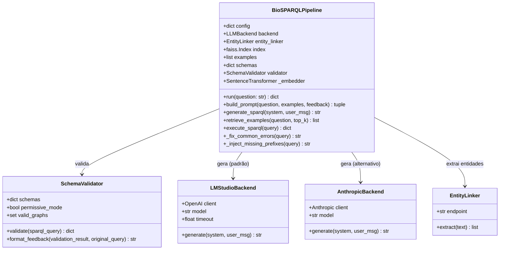
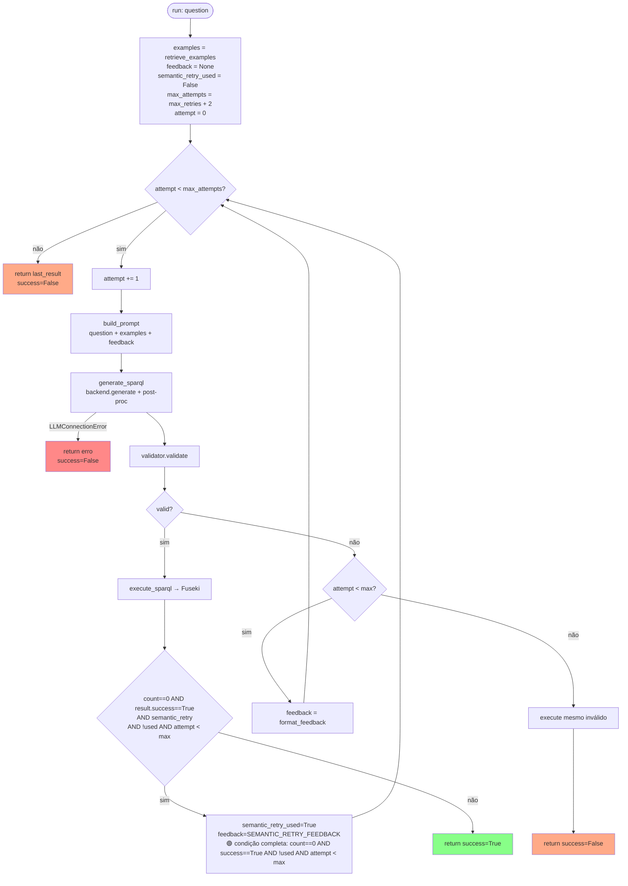
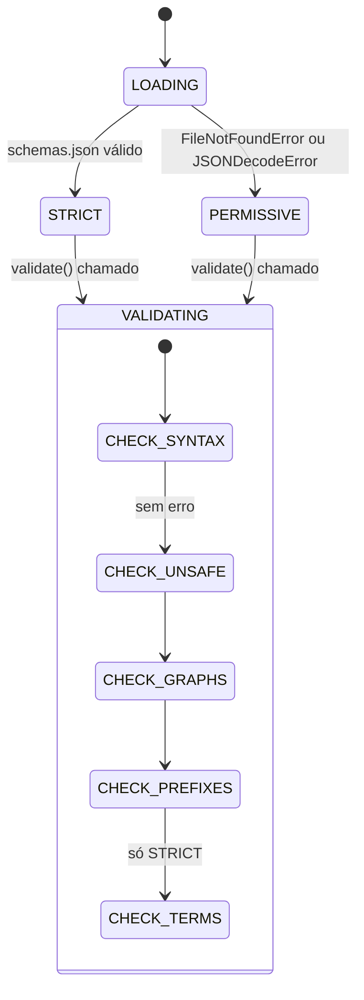

# Design — pipeline

> Unit: `src/pipeline/` | Gerado pelo Redator em 2026-05-04 | doc_level: detalhado

---

## Visão Geral

O módulo `pipeline` implementa o fluxo central NL→SPARQL do BioSPARQL-NL. Seu componente principal, `BioSPARQLPipeline`, orquestra todos os subcomponentes em um loop de autocorreção iterativo: extrai entidades biomédicas da pergunta, recupera exemplos similares do gold standard, constrói um prompt contextualizado, gera SPARQL via LLM, aplica correções determinísticas, valida o resultado e o executa no Fuseki.

---

## Estrutura de Arquivos

| Arquivo | Classe/Função principal | Responsabilidade |
|---|---|---|
| `src/pipeline/nl_to_sparql.py` | `BioSPARQLPipeline` | Orquestrador — loop principal, prompt, pós-processamento |
| `src/pipeline/sparql_validator.py` | `SchemaValidator` | Validação SPARQL (sintaxe, schema, grafos, unsafe ops) |
| `src/pipeline/llm_backends.py` | `LMStudioBackend`, `AnthropicBackend` | Geração LLM plugável com retry |
| `src/pipeline/entity_linker.py` | `EntityLinker` | Bridge pipeline ↔ NER engine |

---

## Diagrama de Classes



---

## Fluxo Principal — `run(question)`



---

## Pós-processamento SPARQL — `_fix_common_errors()`

9 transformações aplicadas sequencialmente (na ordem exata abaixo):

| # | Problema | Correção | Modelo causador |
|---|---|---|---|
| ① | Blocos `DECLARE { }` não existem em SPARQL | Removidos, preservando PREFIX internos | Vários |
| ② | Pseudo-keywords soltas: `DECLARE`, `IMPORT`, `USE`, `NAMESPACE` | Linha inteira removida | Vários |
| ③ | URIs de prefixos canônicos variavam entre modelos | Canonicalização para 9 URIs conhecidas | Vários |
| ④a | `oboInOwl#localname` no corpo da query | Substituído por `oboInOwl:localname` | Nemotron |
| ④b | `pred = ?var` (sintaxe SQL em vez de SPARQL) | Substituído por `pred ?var` | Gemma |
| ④c | `PREFIX doid: <urn:doid>` (URN de grafo como namespace) | Declaração removida | Vários |
| ⑤ | `GRAPH <doid>` sem namespace `urn:` | `<doid>` → `<urn:doid>` | Vários |
| ⑥ | `?x a doid:Disease` (prefixo inválido) | Removido ou substituído por `obo:DOID_4` | Vários |
| ⑦ | `FILTER` após o último `}` (inválido no Jena) | Movido para dentro do WHERE | Nemotron |
| ⑧ | `BIND(REPLACE(STR(?x),...) AS ?x)` — auto-referência | `?x` → `?x_mim` antes do BIND | Vários |

🟢 **CONFIRMADO** — ordem e conteúdo extraídos diretamente de `nl_to_sparql.py:_fix_common_errors()`

---

## Construção do Prompt — `build_prompt()`

O system prompt instrui o LLM com:

1. **Contexto:** Triplestore com 3 grafos nomeados (`urn:doid`, `urn:hpo`, `urn:hpoa`)
2. **Regras de grafo:** qual informação está em qual grafo (RN-03)
3. **Regra PT→EN:** labels em inglês nos FILTER (RN-02)
4. **Regra MIM→OMIM:** JOIN cross-graph via `BIND(REPLACE(..., "^MIM:", "OMIM:"))` (RN-01)
5. **Prefixos proibidos:** `doid:`, `hpo:` não existem no triplestore (RN-04)
6. **Schema ontológico:** classes e predicados válidos por grafo (de `schemas.json`)
7. **Entidades detectadas:** CURIEs resolvidos pelo NER para ancoragem da query
8. **Exemplos few-shot:** top-k pares (pergunta, SPARQL) mais similares do gold standard

O user message contém a pergunta original em português.

Quando `feedback` não é None (tentativa > 1), o user message inclui o feedback de validação ou de semantic retry.

---

## SchemaValidator — Modos de Operação



**Grafos válidos hardcoded:** `{"urn:doid", "urn:hpo", "urn:hpoa"}`
**Operações bloqueadas:** `DELETE`, `INSERT`, `UPDATE` → `UNSAFE_OPERATION`

---

## Injeção de Prefixos — `_inject_missing_prefixes()`

Percorre o corpo da query com regex `(\w+):(\w+)` e detecta prefixos usados mas não declarados. Para cada prefixo reconhecido em `KNOWN_PREFIXES`, injeta a declaração no início da query.

**Prefixos conhecidos:** `rdf`, `rdfs`, `xsd`, `owl`, `obo`, `oboInOwl`, `hpoa`, `skos`, `dc`

---

## Semantic Retry — `SEMANTIC_RETRY_FEEDBACK`

Quando executado, o feedback orienta o LLM a:
1. Usar labels em **inglês** nos `FILTER(CONTAINS(LCASE(?label), "..."))` (febre→fever, etc.)
2. Consultar fenótipos em `urn:hpo` (labels) + `urn:hpoa` (`hpoa:has_phenotype`)
3. Fazer JOIN DOID↔HPOA com `BIND(REPLACE(STR(?xref), "^MIM:", "OMIM:") AS ?oid)`
4. Não usar `doid:` ou `hpo:` como prefixos

Disparado **no máximo uma vez** por chamada de `run()` (flag `semantic_retry_used`).

---

## Interface de Retorno — `run()`

🟡 **INFERIDO** — corrigido pelo Reviewer em 2026-05-04 após inspeção de `nl_to_sparql.py:run()` e `server.py:ask()`

`run()` retorna **apenas** estes campos (docstring linha 388 confirma):

```python
{
    "question": str,          # pergunta original
    "sparql": str,            # query SPARQL final (válida ou não)
    "validation": {
        "valid": bool,
        "errors": list[str],
        "warnings": list[str]
    },
    "execution": {
        "success": bool,
        "results": list[dict], # bindings do Fuseki
        "count": int
    },
    "attempts": int,           # tentativas usadas (1-4)
    "success": bool,           # True se count >= 1
}
```

**`entities`, `examples_used` e `timing` NÃO são retornados por `run()`** — são computados separadamente em `server.py:ask()` (NER e retrieval chamados antes de `pipe.run()`, timing medido por `time.perf_counter()`). A `AskResponse` da API consolida tudo em `ExplainabilityInfo`.

## Interface de Retorno — `AskResponse` (API layer)

🟢 **CONFIRMADO** — `server.py:ExplainabilityInfo` (linha 46)

```python
xai: ExplainabilityInfo {
    entities: list[str],          # labels do NER (computado em server.py)
    examples_used: list[ExampleUsed],
    sparql: str,
    validation: ValidationInfo,
    attempts: int,
    results_raw: list[Any],
    results_count: int,
    timing: TimingInfo {
        ner_s, retrieval_s, llm_s, total_s  # em segundos (não ms)
    }
}
```

**Nota:** os campos de timing são `_s` (segundos), não `_ms` como o spec original afirmava.

---

## Configuração — Parâmetros do Pipeline

| Parâmetro | Tipo | Padrão | Env var | Descrição |
|---|---|---|---|---|
| `endpoint` | str | `http://localhost:3030/biomedical/sparql` | — | URL SPARQL Fuseki |
| `lm_studio_url` | str | `http://localhost:1234/v1` | — | URL LM Studio |
| `llm_model` | str | `"auto"` | `LLM_MODEL` | Modelo LLM |
| `max_retries` | int | `2` | — | Tentativas extras (total = max_retries + 2) |
| `top_k_examples` | int | `3` | — | Exemplos few-shot |
| `llm_timeout` | float | `300.0` | `LLM_TIMEOUT` | Timeout LLM (segundos) — valor inválido faz fallback para 300s com `logger.warning` 🟢 |
| `fuseki_timeout` | int | `30` | — | Timeout Fuseki (segundos) |
| `disable_ner` | bool | `False` | — | Desativa NER (ablação) |
| `disable_schema` | bool | `False` | — | Desativa validação (ablação) |
| `semantic_retry` | bool | `True` | — | Habilita semantic retry |

---

## Decisões de Design

| Decisão | Alternativa descartada | Motivo |
|---|---|---|
| Regex para pós-processamento | Parser SPARQL completo | Parser rejeita queries inválidas antes da correção; regex opera em texto bruto |
| FAISS IndexFlatIP com vetores normalizados | IndexFlatL2 | IP com normalização = cosine similarity exata, sem overhead de normalização on-the-fly |
| Semantic retry como feedback estruturado | Re-prompt idêntico | Re-prompt idêntico produziria a mesma query; feedback direciona o LLM |
| max_attempts = max_retries + 2 | max_attempts = max_retries | +2 garante pelo menos 1 tentativa inicial + 1 semantic retry com margem |
| Última tentativa executa query inválida | Retornar erro imediato | Permite recuperar resultados de queries com warnings não-fatais |
