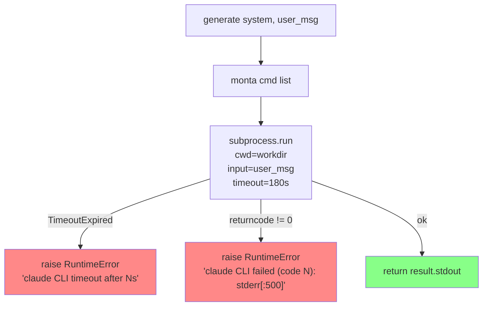
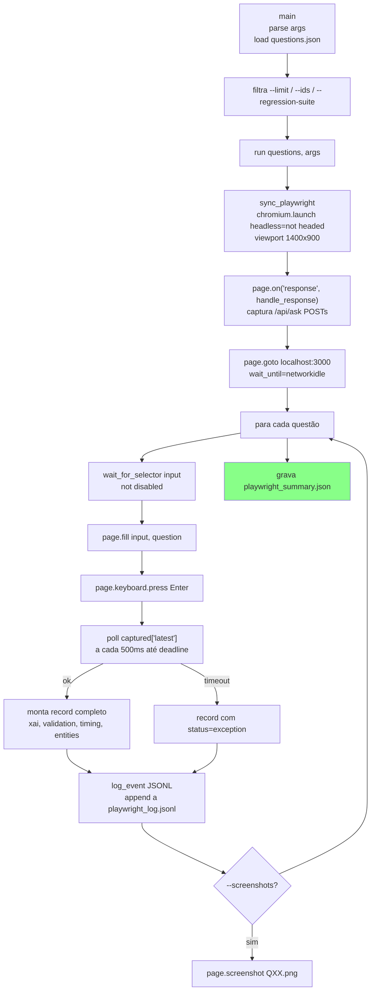

# Design — src2

> Unit: `src2/` | Gerado pelo Redator em 2026-05-04 | doc_level: detalhado

---

## Visão Geral

`src2/` é uma revisão incremental de `src/` que acrescenta dois recursos ortogonais sem modificar o pipeline principal:

1. **`ClaudeCLIBackend`** — backend LLM que reutiliza a sessão OAuth do Claude Code via subprocess `claude --print`, eliminando a necessidade de `ANTHROPIC_API_KEY`.
2. **PlaywrightRunner** — suite de teste E2E que controla o browser para testar as questões do gold standard diretamente pelo frontend.
3. **`corrections_report`** — análise comparativa de regressão/progresso entre duas execuções do Playwright.
4. **`run_all_models.py` (src2)** — orquestrador multi-modelo que inclui o `claude_cli` backend além dos modelos locais.

---

## Estrutura de Arquivos

| Arquivo | Responsabilidade |
|---|---|
| `src2/pipeline/llm_backends.py` | `LMStudioBackend` (com retry), `ClaudeCLIBackend`, `create_backend()` factory |
| `src2/pipeline/nl_to_sparql.py` | `BioSPARQLPipeline` idêntico ao `src/`, mas usa backends de `src2/` |
| `src2/evaluation/playwright_runner.py` | Runner E2E via Playwright — testa frontend completo |
| `src2/evaluation/corrections_report.py` | Comparação baseline vs pós-correções |
| `src2/evaluation/run_evaluation.py` | Avaliação single-model (src2) |
| `src2/evaluation/run_all_models.py` | Orquestrador multi-modelo + Claude CLI |

---

## Design — ClaudeCLIBackend

### Motivação

O `claude` CLI instalado como parte do Claude Code já possui autenticação OAuth ativa. Usar `claude --print` evita o custo de manter `ANTHROPIC_API_KEY` e funciona mesmo em ambientes onde a API key não está disponível (ex: máquina do pesquisador com Claude Code instalado).

A flag `--bare` não é usada porque bloqueia OAuth (exige `ANTHROPIC_API_KEY`). Em vez disso, o isolamento é feito via `cwd` e `--disable-slash-commands`.

🟢 **CONFIRMADO** — comentário em `llm_backends.py:50-60`

### Comando construído

```python
cmd = [
    "claude",
    "--print",                          # modo não-interativo
    "--model", self.model,              # ex: "sonnet"
    "--system-prompt", system,          # substitui o system prompt padrão
    "--output-format", "text",          # stdout = texto puro (sem JSON wrapper)
    "--input-format", "text",           # stdin = texto puro
    "--disable-slash-commands",         # desabilita skills do projeto
]
# Opcional:
if self.max_budget is not None:
    cmd += ["--max-budget-usd", str(self.max_budget)]
```

🟢 **CONFIRMADO** — `llm_backends.py:75-86`

### Execução subprocess

```python
result = subprocess.run(
    cmd,
    input=user_msg,           # user_msg via stdin (evita limite de tamanho de arg)
    capture_output=True,
    text=True,
    encoding="utf-8",
    errors="replace",         # tolera bytes inválidos no stdout
    timeout=self.timeout,     # default: 180s
    check=False,              # não lança exceção em returncode != 0
    cwd=self.workdir,         # ~/.biosparql-bench-workdir (fora de proj1/)
)
```

🟢 **CONFIRMADO** — `llm_backends.py:87-98`

### Fluxo ClaudeCLIBackend.generate()



---

## Design — LMStudioBackend (src2)

Idêntico ao de `src/`, com adição de retry com backoff exponencial:

```python
for attempt in range(3):
    try:
        response = self.client.chat.completions.create(...)
        return response.choices[0].message.content
    except (APIConnectionError, APITimeoutError):
        if attempt < 2:
            time.sleep(2 ** (attempt + 1))   # 2s, 4s
            continue
        raise   # propaga na terceira falha
```

🟢 **CONFIRMADO** — `llm_backends.py:31-47`

---

## Design — create_backend factory

```python
def create_backend(config):
    backend_type = config.get("backend", "lm_studio")
    if backend_type == "claude_cli":
        return ClaudeCLIBackend(config)
    return LMStudioBackend(config)
```

| `config["backend"]` | Backend instanciado |
|---|---|
| `"claude_cli"` | `ClaudeCLIBackend` |
| `"lm_studio"` (default) | `LMStudioBackend` |
| qualquer outro valor | `LMStudioBackend` |

🟢 **CONFIRMADO** — `llm_backends.py:108-113`

---

## Design — PlaywrightRunner

### Fluxo principal



🟢 **CONFIRMADO** — `playwright_runner.py`

### Mecanismo de interceptação de resposta

O Playwright intercepta respostas HTTP do browser via evento `response`. Quando uma resposta para `/api/ask` (POST) chega, o JSON é extraído e armazenado em `captured["latest"]`. O runner faz polling de `captured["latest"]` a cada 500ms até receber dados ou atingir o timeout.

```python
captured = {"latest": None, "error": None}

def handle_response(response):
    if "/api/ask" in response.url and response.request.method == "POST":
        try:
            captured["latest"] = response.json()
        except Exception as e:
            captured["error"] = str(e)

page.on("response", handle_response)
```

🟢 **CONFIRMADO** — `playwright_runner.py:66-73`

### Estrutura do record por questão

```python
record = {
    "id": qid,                        # "Q01"
    "question": question,             # texto em PT
    "question_en": q.get("question_en"),
    "difficulty": q["difficulty"],    # easy / medium / hard
    "type": q["type"],
    "expected_min_results": ...,
    "sparql_patterns": [...],
    "status": "ok" | "failed" | "error" | "exception",
    "success": bool,
    "answer": str,                    # truncado a 500 chars
    "sparql_generated": str,
    "sparql_reference": str,
    "entities": [...],
    "examples_used": [...],
    "validation": {"valid": bool, "errors": [...], "warnings": [...]},
    "attempts": int,
    "results_count": int,
    "results_sample": [...],          # primeiros 5 resultados
    "meets_expected": bool,           # results_count >= expected_min_results
    "timing": {"ner_s", "retrieval_s", "llm_s", "total_s"},
    "elapsed_s": float,
    "timestamp": str,
}
```

🟢 **CONFIRMADO** — `playwright_runner.py:132-164`

### Argumentos CLI

| Argumento | Default | Descrição |
|---|---|---|
| `--limit N` | None | Primeiras N questões |
| `--ids Q01 Q05` | None | IDs específicos |
| `--regression-suite` | False | Usa regression_suite.json (12 Q) |
| `--headed` | False | Browser visível |
| `--screenshots` | False | Captura PNG por questão |
| `--delay-s N` | 0.5 | Delay entre questões (s) |
| `--question-timeout N` | 300 | Timeout por questão (s) |
| `--append` | False | Não apaga log anterior |

🟢 **CONFIRMADO** — `playwright_runner.py:251-260`

---

## Design — corrections_report

### Entradas e Saídas

| Arquivo | Papel |
|---|---|
| `output2/playwright_log_baseline.jsonl` | Snapshot pré-correções (criado manualmente pelo pesquisador) |
| `output2/playwright_log.jsonl` | Log pós-correções (atualizado a cada Playwright run) |
| `output2/corrections_report.json` | Relatório estruturado |
| `output2/corrections_report.md` | Relatório em Markdown para leitura humana |

### Classificação por questão

```python
for qid in sorted(set(base.keys()) | set(corr.keys())):
    b = base.get(qid, {}).get("success", False)
    c = corr.get(qid, {}).get("success", False)
    if not b and c:   → recovered   (falhou antes, passa agora)
    elif b and not c: → regressed   (passava antes, falha agora)
    elif b and c:     → still_ok
    else:             → still_fail
```

🟢 **CONFIRMADO** — `corrections_report.py:52-68`

### Classificação de falhas

```python
def classify_failure(record):
    if not validation.get("valid", True):
        if "SYNTAX" in str(errors[0]).upper(): → "syntax_error"
        else:                                  → "validation_error"
    if record.get("status") == "exception":    → "timeout_or_exception"
    else:                                      → "zero_results"
```

🟢 **CONFIRMADO** — `corrections_report.py:71-83`

---

## Design — run_all_models.py (src2)

### Estratégia de verificação antes de rodar

```
Para cada modelo local:
  1. check_lm_studio_model() — modelo está na lista /v1/models?
  2. check_lm_studio_responds() — modelo responde a "Say OK" em 60s?
  3. Se ambos ok → run_evaluation(model, backend="lm_studio")

Para Claude CLI:
  1. check_claude_cli() — `claude --version` retorna 0?
  2. Se ok → run_evaluation("sonnet", backend="claude_cli")
```

### Skip de modelos já avaliados

Se `output2/eval_{safe_name}.json` existe com `total >= 50` questões, o modelo é pulado (sem re-execução).

🟢 **CONFIRMADO** — `run_all_models.py:72-79`

---

## Artefatos de Saída

| Arquivo | Gerado por | Conteúdo |
|---|---|---|
| `output2/playwright_log.jsonl` | PlaywrightRunner | Record completo por questão (JSONL) |
| `output2/playwright_summary.json` | PlaywrightRunner | Métricas consolidadas |
| `output2/playwright_log_baseline.jsonl` | Pesquisador (cp manual) | Snapshot pré-correção |
| `output2/playwright_screenshots/QXX.png` | PlaywrightRunner `--screenshots` | Screenshot por questão |
| `output2/corrections_report.json` | corrections_report | Diff estruturado baseline vs atual |
| `output2/corrections_report.md` | corrections_report | Relatório Markdown |
| `output2/regression_log.jsonl` | PlaywrightRunner `--regression-suite` | Log do subset de regressão |
| `output2/eval_{safe_name}.json` | run_evaluation (src2) | Resultado avaliação por modelo |
