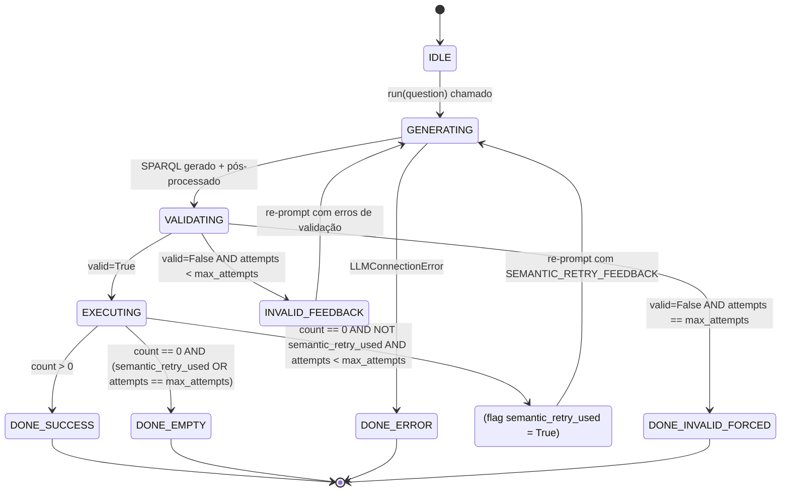
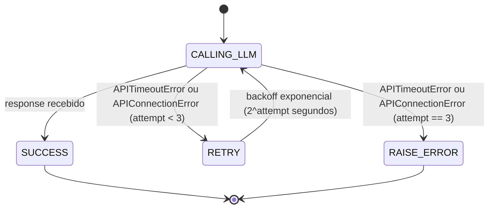
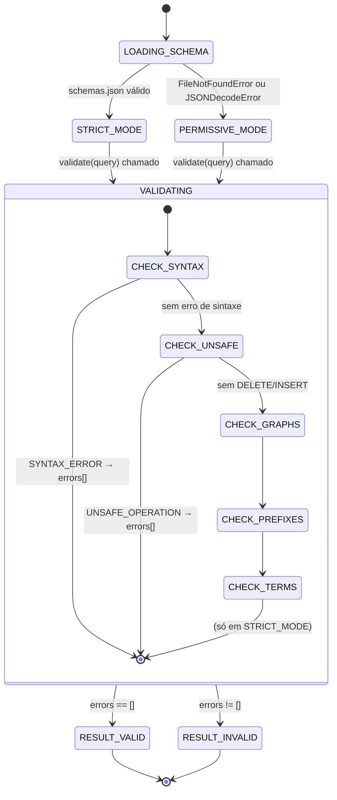
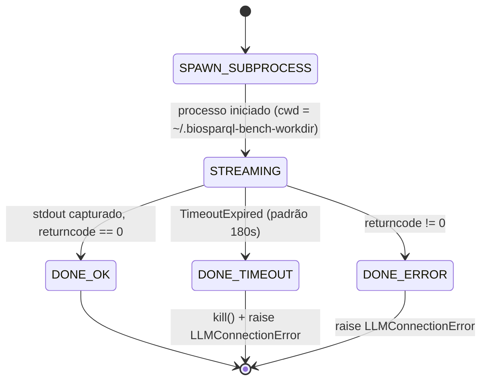
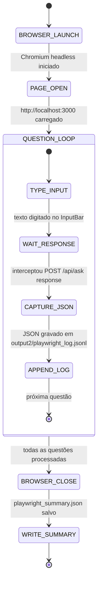

# Máquinas de Estado — BioSPARQL-NL

> Gerado pelo Detetive em 2026-05-04 | doc_level: detalhado

---

## SM-01 — Loop de Geração SPARQL (`BioSPARQLPipeline.run()`)

**Localização:** `src/pipeline/nl_to_sparql.py:run()` (linhas 385–483)
**Confiança:** 🟢 CONFIRMADO — extraído diretamente do código

Esta é a máquina de estado central do sistema. Governa o ciclo de tentativas de geração, validação, execução e correção de queries SPARQL.

### Estados

| Estado | Descrição |
|---|---|
| `IDLE` | Pipeline aguardando pergunta (antes de `run()` ser chamado) |
| `GENERATING` | Chamada ao backend LLM em andamento |
| `VALIDATING` | Query submetida ao `SchemaValidator` |
| `INVALID_FEEDBACK` | Query inválida; feedback formatado para re-prompt |
| `EXECUTING` | Query válida enviada ao Fuseki |
| `SEMANTIC_RETRY` | Query válida mas 0 resultados; re-prompt com feedback semântico |
| `DONE_SUCCESS` | Resultado com ≥1 binding retornado |
| `DONE_EMPTY` | Todas as tentativas esgotadas; 0 resultados |
| `DONE_ERROR` | LLMConnectionError ou FusekiConnectionError irrecuperável |
| `DONE_INVALID_FORCED` | Última tentativa inválida — query executada mesmo assim |

### Diagrama de Estados (Mermaid)



### Tabela de Transições

| Estado atual | Condição | Próximo estado |
|---|---|---|
| `IDLE` | `run(question)` chamado | `GENERATING` |
| `GENERATING` | SPARQL gerado com sucesso | `VALIDATING` |
| `GENERATING` | `LLMConnectionError` | `DONE_ERROR` |
| `VALIDATING` | `valid=True` | `EXECUTING` |
| `VALIDATING` | `valid=False` AND `attempt < max_attempts` | `INVALID_FEEDBACK` |
| `VALIDATING` | `valid=False` AND `attempt == max_attempts` | `DONE_INVALID_FORCED` |
| `INVALID_FEEDBACK` | feedback formatado | `GENERATING` |
| `EXECUTING` | `count > 0` | `DONE_SUCCESS` |
| `EXECUTING` | `count == 0` AND `not semantic_retry_used` AND `attempt < max_attempts` | `SEMANTIC_RETRY` |
| `EXECUTING` | `count == 0` AND (`semantic_retry_used` OR `attempt == max_attempts`) | `DONE_EMPTY` |
| `SEMANTIC_RETRY` | feedback semântico preparado, `semantic_retry_used = True` | `GENERATING` |

### Contadores e limites

```
max_attempts = max_retries + 2   # padrão: 2 + 2 = 4 tentativas totais
semantic_retry: apenas 1 vez por execução de run()
```

---

## SM-02 — Estado do Backend LLM (`LMStudioBackend.generate()`)

**Localização:** `src/pipeline/llm_backends.py:LMStudioBackend.generate()`
**Confiança:** 🟢 CONFIRMADO

Micro-máquina de retry para chamadas HTTP ao LM Studio.



**Nota:** `max_tokens` é controlável via env var `LLM_MAX_TOKENS` (padrão: 3000). Modelos de raciocínio (Nemotron) consomem tokens em `reasoning_content` antes do `content` visível.

---

## SM-03 — Estado do `SchemaValidator`

**Localização:** `src/pipeline/sparql_validator.py`
**Confiança:** 🟢 CONFIRMADO

O validator tem dois modos de operação determinados na inicialização:



**Diferença STRICT vs PERMISSIVE:** Em modo permissivo, `CHECK_TERMS` (validação de classes/predicados contra schema) é pulado. As demais checagens (sintaxe, unsafe, grafos, prefixos) ocorrem em ambos os modos.

---

## SM-04 — Estado do `ClaudeCLIBackend` (src2)

**Localização:** `src2/pipeline/llm_backends.py:ClaudeCLIBackend`
**Confiança:** 🟢 CONFIRMADO

Gerencia subprocesso `claude` CLI com timeout explícito.



**Isolamento:** roda em diretório temporário fora de `proj1/` para evitar auto-discovery do `CLAUDE.md` e contaminação do contexto.

---

## SM-05 — Estado do Playwright Runner (`playwright_runner.py`)

**Localização:** `src2/evaluation/playwright_runner.py`
**Confiança:** 🟢 CONFIRMADO

Automação E2E sobre o frontend React.


