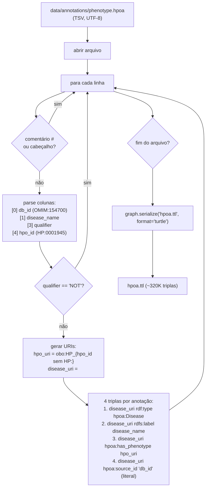
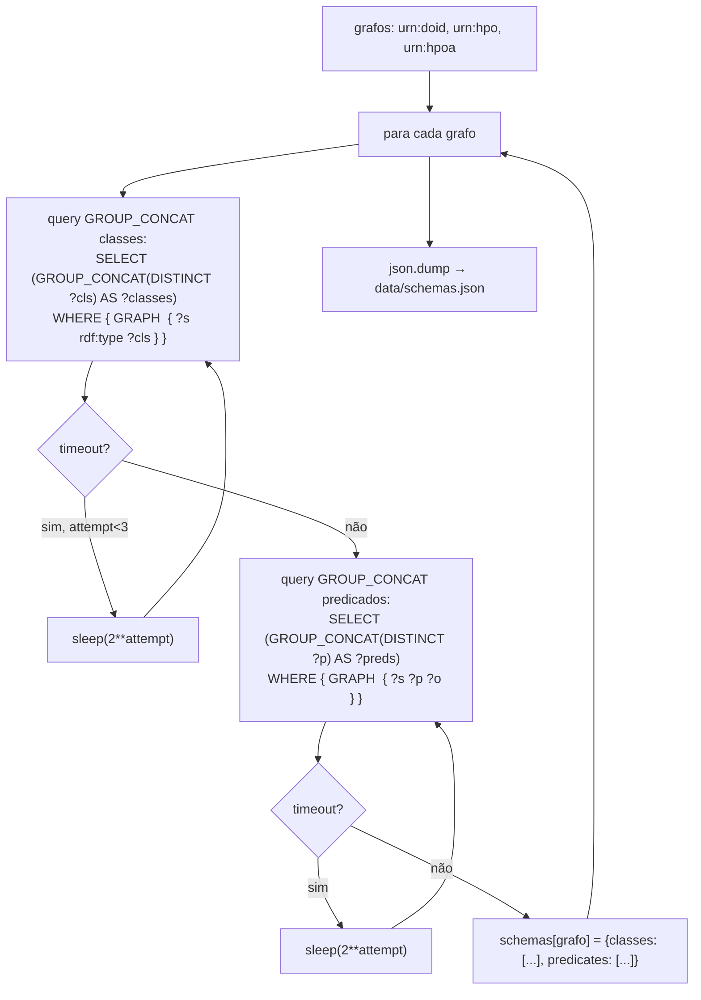
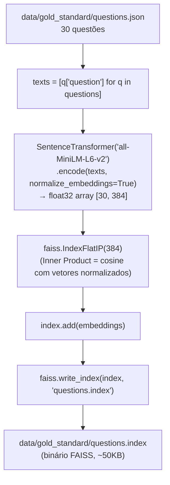

# Design — utilitarios

> Unit: `src/utils/` | Gerado pelo Redator em 2026-05-04 | doc_level: detalhado

---

## Visão Geral

O módulo `utilitarios` contém scripts de preparação de dados executados uma única vez em setup-time. Cada script é independente, sem dependências entre si, e produz um artefato persistido usado pelo pipeline em runtime. O design é simples e linear — sem classes abstratas ou padrões complexos.

---

## Estrutura de Arquivos

| Arquivo | Artefato gerado | Usado por |
|---|---|---|
| `src/utils/hpoa_to_rdf.py` | `data/annotations/hpoa.ttl` | Fuseki (carga manual) |
| `src/utils/schema_extractor.py` | `data/schemas.json` | `SchemaValidator` |
| `src/utils/index_builder.py` | `data/gold_standard/questions.index` | `BioSPARQLPipeline.retrieve_examples()` |
| `src/utils/gold_standard.py` | `data/gold_standard/questions.json` | `run_evaluation.py`, `index_builder.py` |

---

## `hpoa_to_rdf.py` — Conversão TSV → Turtle

### Fluxo



### Namespace e URIs

```python
HPOA = Namespace("http://purl.obolibrary.org/obo/hp/")
OBO  = Namespace("http://purl.obolibrary.org/obo/")
DIS  = Namespace("http://example.org/disease/")

# HP:0001945 → obo:HP_0001945
hpo_uri = OBO[f"HP_{hpo_id.replace('HP:', '')}"]

# OMIM:154700 → <http://example.org/disease/OMIM_154700>
disease_uri = DIS[f"OMIM_{db_id.replace('OMIM:', '')}"]

# source_id é literal (não URI) — crucial para JOIN com DOID via REPLACE
graph.add((disease_uri, HPOA.source_id, Literal(db_id)))  # "OMIM:154700"
```

🟢 **CONFIRMADO** — RN-01, RN-05

---

## `schema_extractor.py` — Introspecção SPARQL

### Fluxo



### Estrutura de `schemas.json`

```json
{
  "urn:doid": {
    "classes": [
      "http://www.w3.org/2002/07/owl#Class",
      "http://purl.obolibrary.org/obo/DOID_4"
    ],
    "predicates": [
      "http://www.w3.org/2000/01/rdf-schema#label",
      "http://www.geneontology.org/formats/oboInOwl#hasDbXref",
      "http://www.w3.org/2002/07/owl#subClassOf"
    ]
  },
  "urn:hpo": { "classes": [...], "predicates": [...] },
  "urn:hpoa": { "classes": [...], "predicates": [...] }
}
```

🟢 **CONFIRMADO** — ADR-P03

---

## `index_builder.py` — Índice FAISS

### Fluxo



### Por que IndexFlatIP + normalização = cosine

```
cosine(a, b) = (a · b) / (|a| × |b|)

Se |a| = |b| = 1.0 (vetores normalizados):
  cosine(a, b) = a · b = IndexFlatIP(a, b)

Portanto: IndexFlatIP com vetores normalizados ≡ busca por similaridade cosine exata.
```

🟢 **CONFIRMADO** — `index_builder.py:build_index()` + ADR-P04

### Uso em runtime (`retrieve_examples`)

```python
# Em BioSPARQLPipeline.retrieve_examples():
embedding = self._embedder.encode([question], normalize_embeddings=True)
distances, indices = self.index.search(embedding, top_k)
examples = [self.examples[i] for i in indices[0]]
```

---

## `gold_standard.py` — Gestão do Gold Standard

Script auxiliar para criar/validar `data/gold_standard/questions.json`. Estrutura de cada questão:

```json
{
  "id": "Q01",
  "question": "Quais fenótipos estão associados ao Parkinson?",
  "difficulty": "easy",
  "category": "phenotype",
  "sparql_reference": "SELECT ?phenotype WHERE { ... }",
  "expected_contains": ["tremor", "rigidity"],
  "min_expected": 1
}
```

| Campo | Obrigatório | Descrição |
|---|---|---|
| `id` | Sim | Q01–Q30 |
| `question` | Sim | Pergunta em português |
| `difficulty` | Sim | `easy` \| `medium` \| `hard` |
| `sparql_reference` | Não | Query de referência (não usada no pipeline) |
| `expected_contains` | Não | Termos para spot-check semântico |
| `min_expected` | Não | Mínimo de resultados esperados (padrão: 1) |

---

## Dependências entre Utilitários (ordem de execução)

```
1. hpoa_to_rdf.py          → gera hpoa.ttl
2. [carga manual no Fuseki] → carrega doid.owl, hp.owl, hpoa.ttl
3. schema_extractor.py      → gera schemas.json   (requer Fuseki online)
4. index_builder.py         → gera questions.index (requer questions.json)
```

Os passos 3 e 4 são independentes entre si, mas ambos dependem dos anteriores.

---

## Encoding e Compatibilidade Windows

Todos os `print()` devem usar ASCII puro (`[OK]`, `[FAIL]`, `[INFO]`). Nunca usar emojis ou caracteres UTF-8 acima de U+007F sem `sys.stdout.reconfigure(encoding='utf-8')`.

🟢 **CONFIRMADO** — `CLAUDE.md` — "Encoding Windows"
